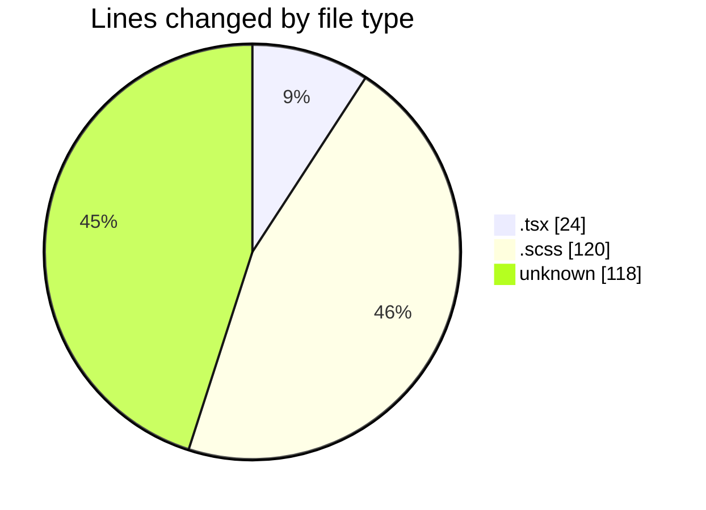
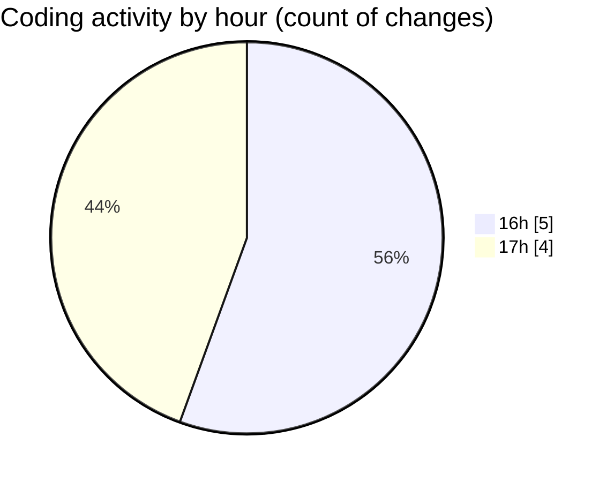

# cda - Activity Summary 

## Overall Statistics

| Stat                   | Value                                                             |
| ---------------------- | ----------------------------------------------------------------- |
| **Lines Added** (➕)   | 190                                          |
| **Lines Removed** (➖) | 72                                        |
| **Net Change** (↕)    | 118                |
| **Active Time** (⌚)   | 5 minutes |

## Modified Files
- **index.tsx** (+9, -9)
- **badge.scss** (+30, -30)
- **index.tsx** (+3, -3)
- **statsBox.scss** (+30, -30)
- **.env** (+118, -0)

## Visualizations

### By File Type (Lines Changed)

### By Hour (Estimated Activity Count)

> **Last Updated:** 19/05/2026, 17:22:26