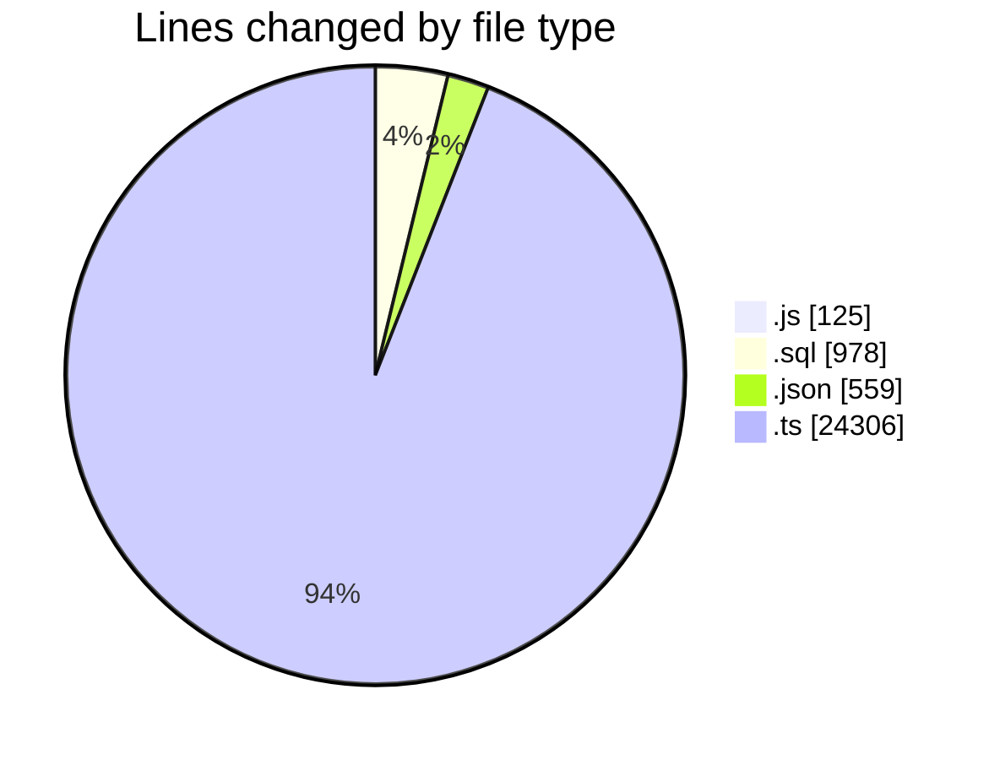
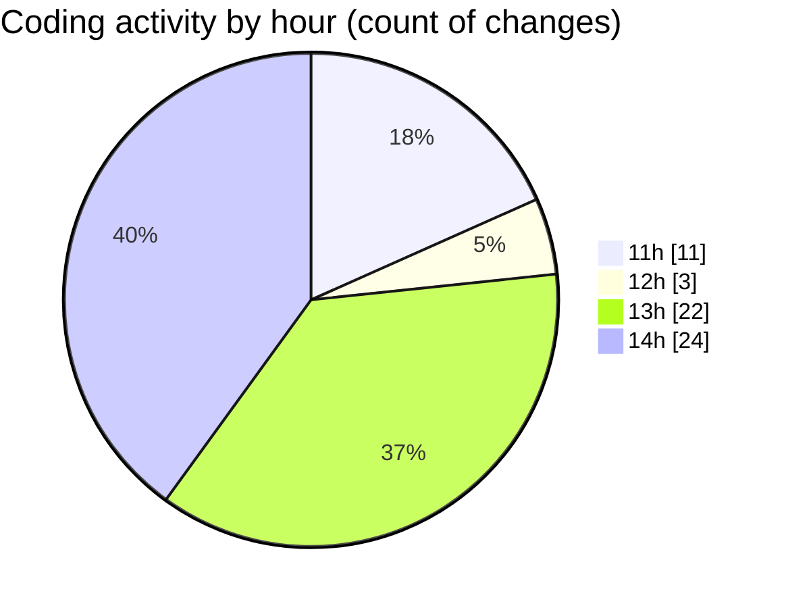

# cda - Activity Summary 

## Overall Statistics

| Stat                   | Value                                                             |
| ---------------------- | ----------------------------------------------------------------- |
| **Lines Added** (➕)   | 25925                                          |
| **Lines Removed** (➖) | 43                                        |
| **Net Change** (↕)    | 25882                |
| **Active Time** (⌚)   | 78 minutes |

## Modified Files
- **20260520100754-create-it-kit-starter-email-sent.js** (+41, -0)
- **20260520101754-create-it-kit-starter-candidates.js** (+29, -1)
- **create-users.sql** (+978, -0)
- **20260520101754-create-it-kit-starter-candidates.js** (+54, -0)
- **lambda.json** (+224, -32)
- **lambda.json** (+242, -0)
- **index.ts** (+37, -2)
- **package.json** (+61, -0)
- **Controller.ts** (+65, -6)
- **views.ts** (+9429, -2)
- **tables.ts** (+6705, -0)
- **sap_views.ts** (+1824, -0)
- **sap_tables.ts** (+902, -0)
- **clear_view_views.ts** (+4657, -0)
- **clear_view_controlled_tables.ts** (+677, -0)

## Visualizations

### By File Type (Lines Changed)

### By Hour (Estimated Activity Count)

> **Last Updated:** 20/05/2026, 14:35:09