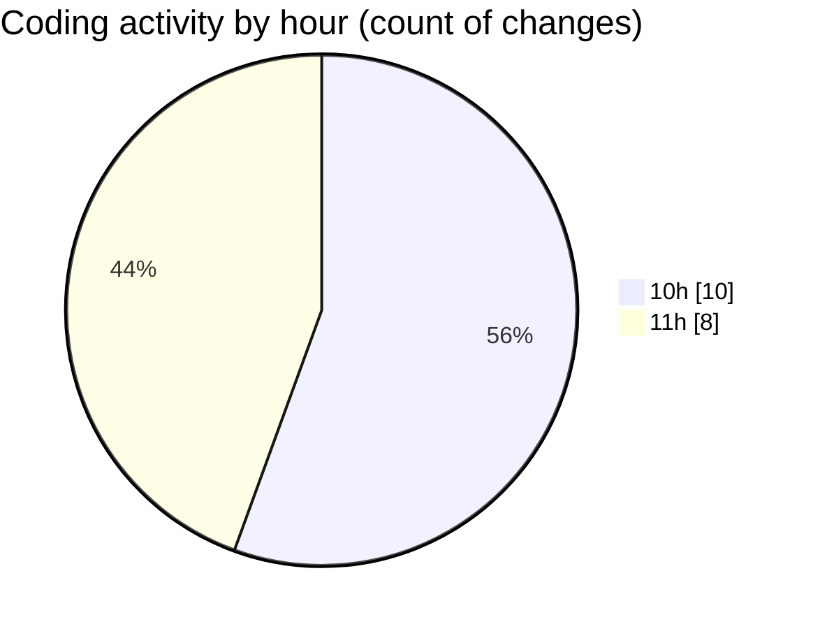

# PDF Invoice - Activity Summary 

## Overall Statistics

| Stat                   | Value                                                             |
| ---------------------- | ----------------------------------------------------------------- |
| **Lines Added** (➕)   | 3158                                          |
| **Lines Removed** (➖) | 484                                        |
| **Net Change** (↕)    | 2674                |
| **Active Time** (⌚)   | 28 minutes |

## Modified Files
- **My Little Friends invoice.html** (+899, -0)
- **chatLanguageModels.json** (+12, -0)
- **test.html** (+848, -484)
- **invoice 2.html** (+420, -0)
- **invoice 3.html** (+469, -0)
- **invoice-00.html** (+510, -0)

## Visualizations

### By File Type (Lines Changed)

### By Hour (Estimated Activity Count)

> **Last Updated:** 21/05/2026, 11:10:05