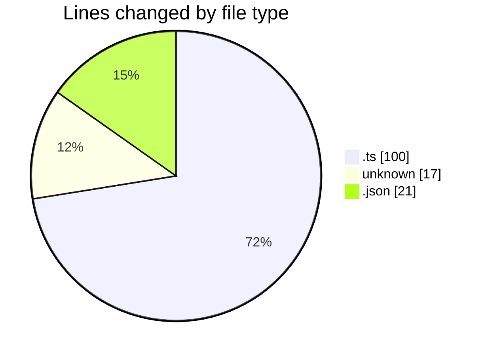
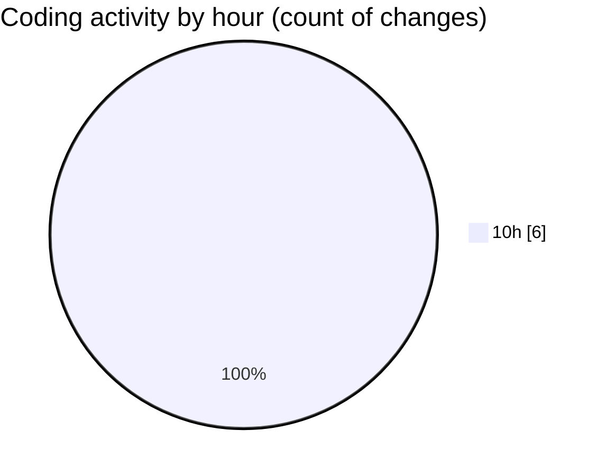

# cda - Activity Summary 

## Overall Statistics

| Stat                   | Value                                                             |
| ---------------------- | ----------------------------------------------------------------- |
| **Lines Added** (➕)   | 34                                          |
| **Lines Removed** (➖) | 104                                        |
| **Net Change** (↕)    | -70                |
| **Active Time** (⌚)   | 4 minutes |

## Modified Files
- **RecipientsList.test.ts** (+0, -51)
- **recordEmailSentToUsers.test.ts** (+0, -49)
- **itkit-leaver-starterjson** (+17, -0)
- **itkit-starter-manager.json** (+17, -4)

## Visualizations

### By File Type (Lines Changed)

### By Hour (Estimated Activity Count)

> **Last Updated:** 22/05/2026, 10:34:26