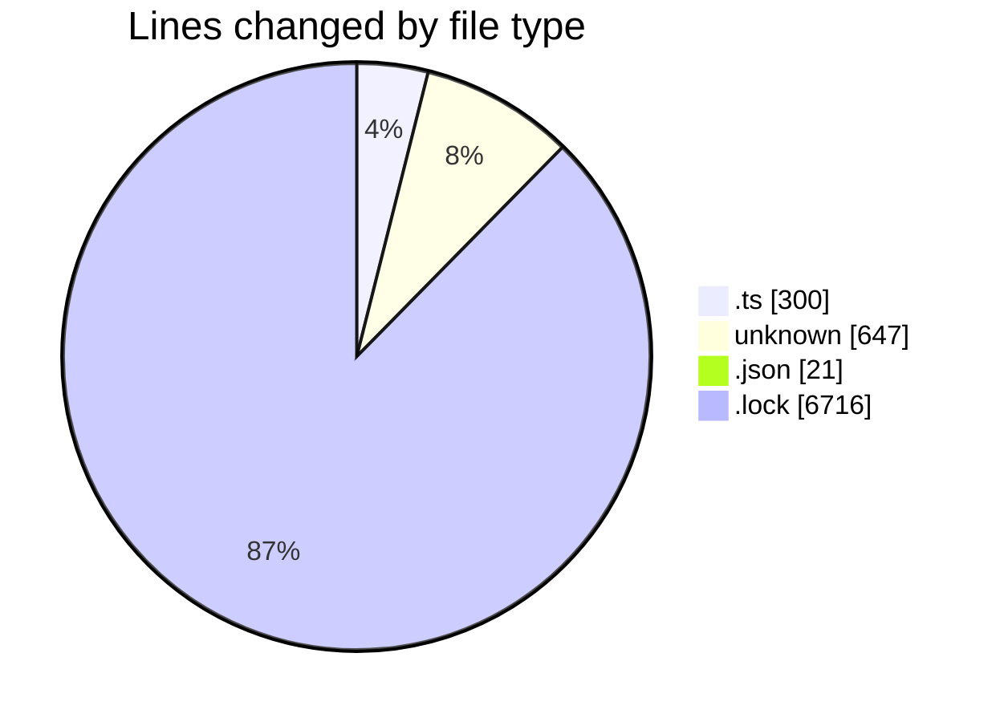

# cda - Activity Summary 

## Overall Statistics

| Stat                   | Value                                                             |
| ---------------------- | ----------------------------------------------------------------- |
| **Lines Added** (➕)   | 7480                                          |
| **Lines Removed** (➖) | 204                                        |
| **Net Change** (↕)    | 7276                |
| **Active Time** (⌚)   | 27 minutes |

## Modified Files
- **RecipientsList.test.ts** (+51, -102)
- **recordEmailSentToUsers.test.ts** (+49, -98)
- **itkit-leaver-starterjson** (+17, -0)
- **itkit-starter-manager.json** (+17, -4)
- **cda** (+630, -0)
- **yarn.lock** (+3339, -0)
- **yarn.lock** (+3377, -0)

## Visualizations

### By File Type (Lines Changed)

### By Hour (Estimated Activity Count)

> **Last Updated:** 22/05/2026, 10:39:26