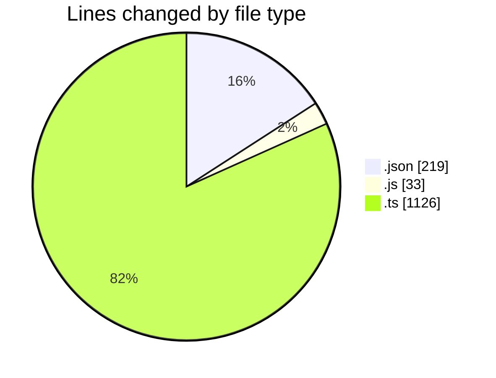
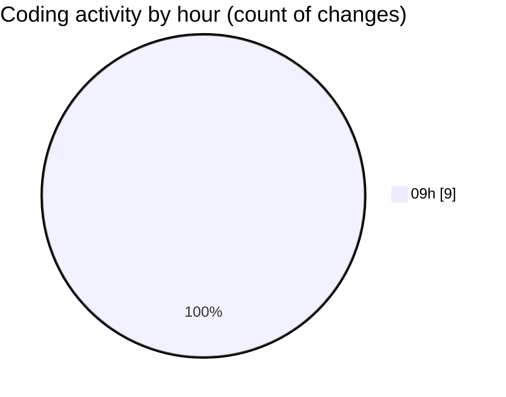

# cda - Activity Summary 

## Overall Statistics

| Stat                   | Value                                                             |
| ---------------------- | ----------------------------------------------------------------- |
| **Lines Added** (➕)   | 1378                                          |
| **Lines Removed** (➖) | 0                                        |
| **Net Change** (↕)    | 1378                |
| **Active Time** (⌚)   | 11 minutes |

## Modified Files
- **lambda.json** (+187, -0)
- **20250814161854-replace-it-kit-people-end-date-view.js** (+33, -0)
- **RecipientsList.test.ts** (+579, -0)
- **recordEmailSentToUsers.test.ts** (+219, -0)
- **RecipientsList.ts** (+84, -0)
- **RecipientsList.test.ts** (+185, -0)
- **Controller.ts** (+59, -0)
- **package.json** (+32, -0)

## Visualizations

### By File Type (Lines Changed)

### By Hour (Estimated Activity Count)

> **Last Updated:** 27/05/2026, 09:57:19