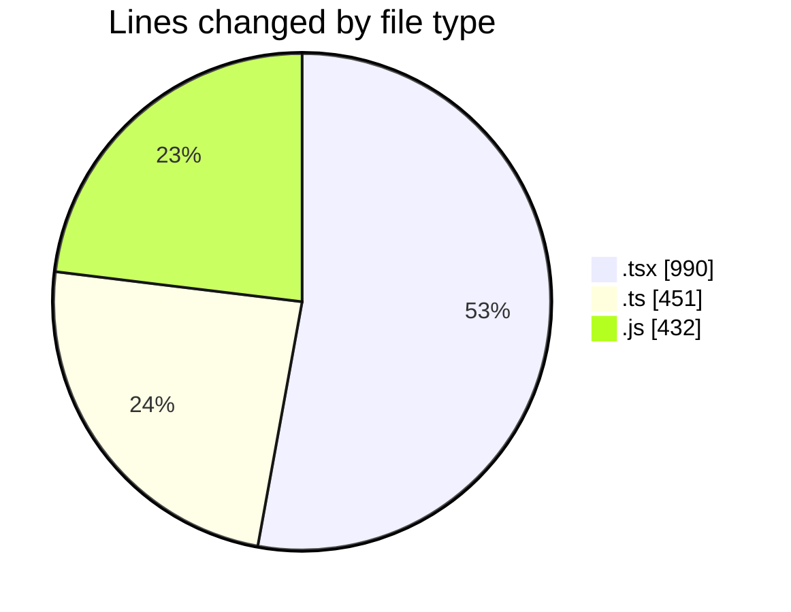
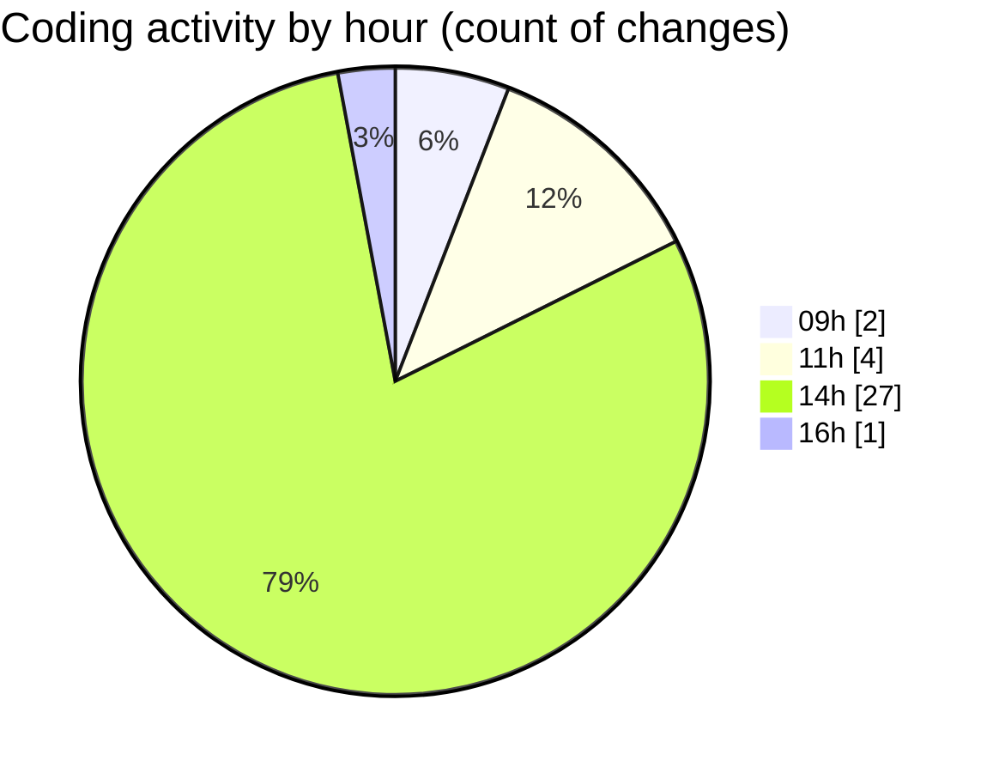

# cda - Activity Summary 

## Overall Statistics

| Stat                   | Value                                                             |
| ---------------------- | ----------------------------------------------------------------- |
| **Lines Added** (➕)   | 1644                                          |
| **Lines Removed** (➖) | 229                                        |
| **Net Change** (↕)    | 1415                |
| **Active Time** (⌚)   | 38 minutes |

## Modified Files
- **Duty.tsx** (+375, -226)
- **DutyWeekWrapper.tsx** (+64, -0)
- **App.tsx** (+109, -0)
- **SkillAdmin.tsx** (+55, -0)
- **ManageGroupsTab.tsx** (+64, -0)
- **index.ts** (+4, -0)
- **SkillAdmin.test.tsx** (+94, -3)
- **20260529110000-create-profile-skill-group-table.js** (+24, -0)
- **20260529110030-create-profile-skill-group-to-person-table.js** (+21, -0)
- **20260529110100-create-profile-skill-groups-view.js** (+32, -0)
- **20260529110130-create-profile-skill-group-members-view.js** (+29, -0)
- **skills.js** (+107, -0)
- **queries.js** (+121, -0)
- **mutations.js** (+98, -0)
- **codegen.ts** (+28, -0)
- **skill-queries.ts** (+419, -0)

## Visualizations

### By File Type (Lines Changed)

### By Hour (Estimated Activity Count)

> **Last Updated:** 29/05/2026, 16:29:18