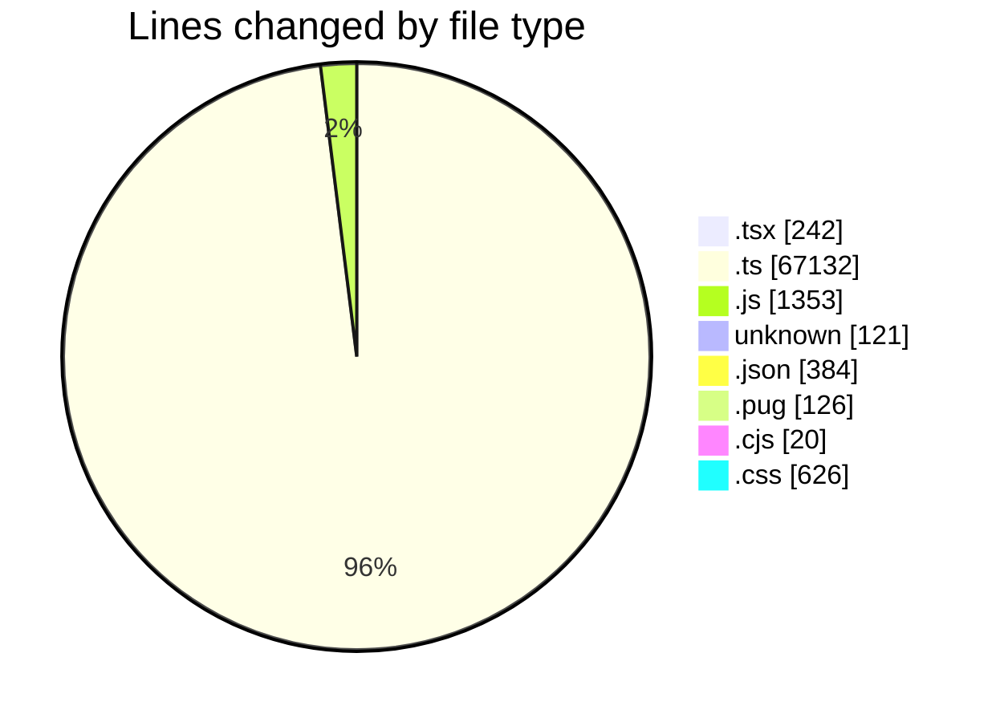
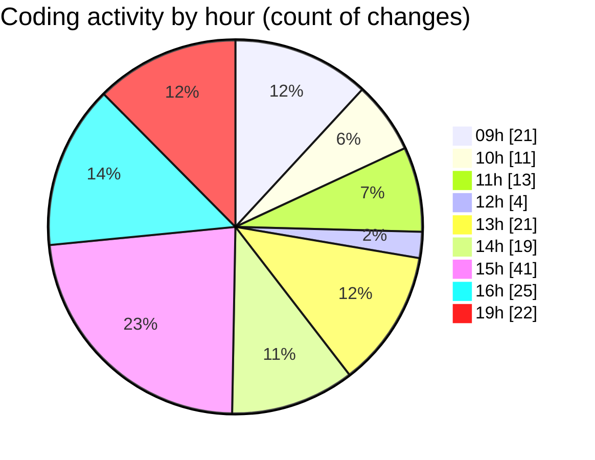

# cda - Activity Summary 

## Overall Statistics

| Stat                   | Value                                                             |
| ---------------------- | ----------------------------------------------------------------- |
| **Lines Added** (➕)   | 68866                                          |
| **Lines Removed** (➖) | 1138                                        |
| **Net Change** (↕)    | 67728                |
| **Active Time** (⌚)   | 204 minutes |

## Modified Files
- **SkillAdmin.tsx** (+55, -5)
- **index.ts** (+4, -0)
- **ManageGroupsTab.tsx** (+64, -6)
- **SkillAdmin.test.tsx** (+91, -21)
- **20260529110000-create-profile-skill-group-table.js** (+24, -0)
- **20260529110030-create-profile-skill-group-to-person-table.js** (+22, -1)
- **20260529110100-create-profile-skill-groups-view.js** (+32, -0)
- **20260529110130-create-profile-skill-group-members-view.js** (+29, -0)
- **skills.js** (+247, -105)
- **queries.js** (+148, -48)
- **codegen.ts** (+28, -0)
- **mutations.js** (+98, -15)
- **skill-queries.ts** (+789, -612)
- **skills.ts** (+518, -0)
- **20260601085728-create-profile-skill-group-table.js** (+24, -1)
- **20260601092204-create-profile-skill-group-to-person-table.js** (+21, -0)
- **20260529102439-create-profile-skill-groups-view.js** (+32, -0)
- **20260529104332-create-profile-skill-group-members-view.js** (+29, -0)
- **20260529085728-create-profile-skill-group-table.js** (+25, -1)
- **vulcan_views.ts** (+155, -0)
- **vulcan.ts** (+1950, -0)
- **views.ts** (+9623, -95)
- **tables.ts** (+6755, -0)
- **clear_view_views.ts** (+4797, -0)
- **.env** (+121, -0)
- **settings.json** (+57, -0)
- **skill-groups.ts** (+154, -28)
- **skill-mutations.ts** (+257, -91)
- **resolvers-types.ts** (+15522, -0)
- **resolvers-types.ts** (+11609, -0)
- **settings.json** (+98, -10)
- **desks.ts** (+1038, -0)
- **views.ts** (+9528, -0)
- **html.pug** (+58, -0)
- **lambda.json** (+187, -0)
- **20250814161854-replace-it-kit-people-end-date-view.js** (+33, -0)
- **RecipientsList.test.ts** (+579, -0)
- **recordEmailSentToUsers.test.ts** (+219, -0)
- **RecipientsList.test.ts** (+176, -0)
- **RecipientsList.ts** (+80, -0)
- **Controller.ts** (+74, -0)
- **package.json** (+32, -0)
- **batchSnsMessages.ts** (+60, -0)
- **20260520100754-create-it-kit-starter-email-sent.js** (+21, -0)
- **recordEmailSentToStarters.ts** (+22, -0)
- **recordEmailSentToStarters.test.ts** (+167, -0)
- **jest.config.cjs** (+20, -0)
- **html.pug** (+61, -7)
- **style.css** (+314, -12)
- **style.css** (+290, -10)
- **SkillGroups.ts** (+182, -43)
- **SkillGroups.test.ts** (+301, -18)
- **skill-group-queries.ts** (+304, -6)
- **skill-group-mutations.ts** (+314, -2)
- **skills.js** (+397, -0)
- **skill-queries.ts** (+285, -1)
- **skill-mutations.ts** (+746, -0)

## Visualizations

### By File Type (Lines Changed)

### By Hour (Estimated Activity Count)

> **Last Updated:** 01/06/2026, 19:59:21