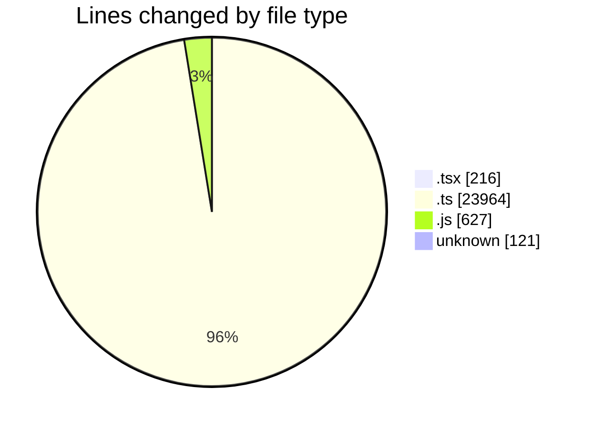
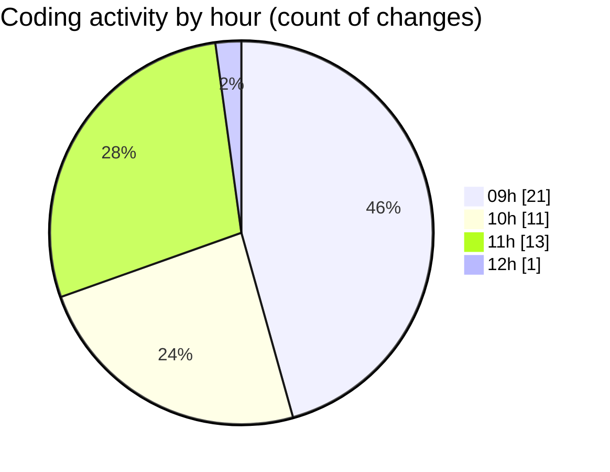

# cda - Activity Summary 

## Overall Statistics

| Stat                   | Value                                                             |
| ---------------------- | ----------------------------------------------------------------- |
| **Lines Added** (➕)   | 24808                                          |
| **Lines Removed** (➖) | 120                                        |
| **Net Change** (↕)    | 24688                |
| **Active Time** (⌚)   | 52 minutes |

## Modified Files
- **SkillAdmin.tsx** (+55, -0)
- **index.ts** (+4, -0)
- **ManageGroupsTab.tsx** (+64, -6)
- **SkillAdmin.test.tsx** (+91, -0)
- **20260529110000-create-profile-skill-group-table.js** (+24, -0)
- **20260529110030-create-profile-skill-group-to-person-table.js** (+22, -1)
- **20260529110100-create-profile-skill-groups-view.js** (+32, -0)
- **20260529110130-create-profile-skill-group-members-view.js** (+29, -0)
- **skills.js** (+107, -13)
- **queries.js** (+148, -5)
- **codegen.ts** (+28, -0)
- **mutations.js** (+98, -15)
- **skill-queries.ts** (+425, -78)
- **skills.ts** (+244, -0)
- **20260601085728-create-profile-skill-group-table.js** (+24, -1)
- **20260601092204-create-profile-skill-group-to-person-table.js** (+21, -0)
- **20260529102439-create-profile-skill-groups-view.js** (+32, -0)
- **20260529104332-create-profile-skill-group-members-view.js** (+29, -0)
- **20260529085728-create-profile-skill-group-table.js** (+25, -1)
- **vulcan_views.ts** (+155, -0)
- **vulcan.ts** (+1950, -0)
- **views.ts** (+9528, -0)
- **tables.ts** (+6755, -0)
- **clear_view_views.ts** (+4797, -0)
- **.env** (+121, -0)

## Visualizations

### By File Type (Lines Changed)

### By Hour (Estimated Activity Count)

> **Last Updated:** 01/06/2026, 12:43:36