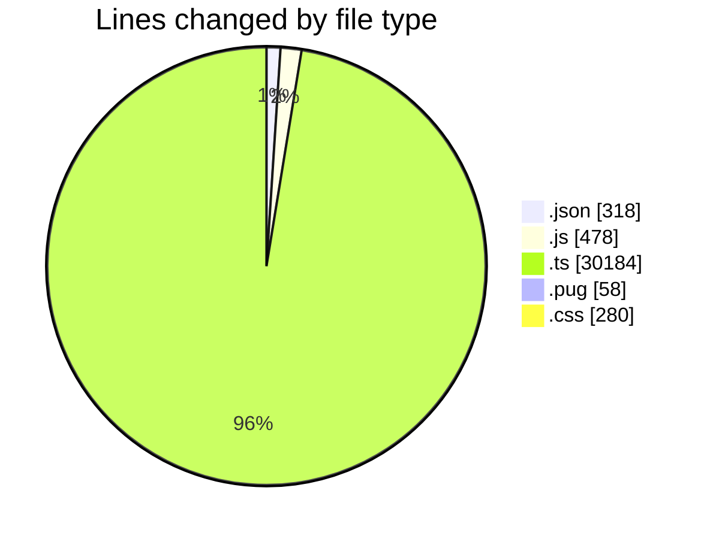
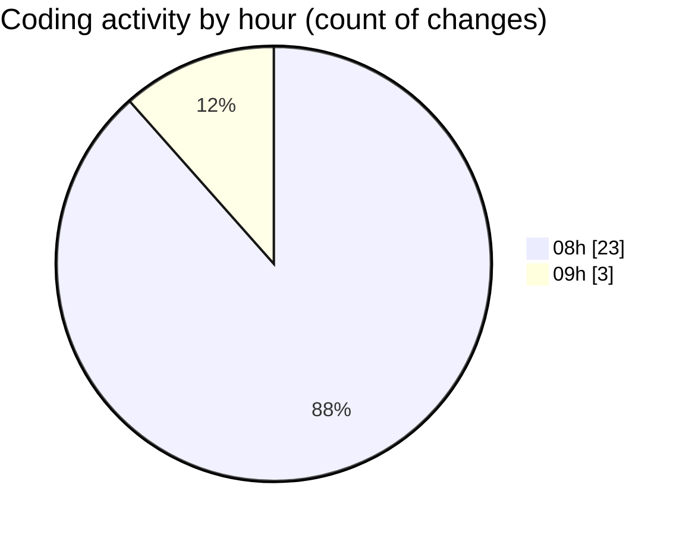

# cda - Activity Summary 

## Overall Statistics

| Stat                   | Value                                                             |
| ---------------------- | ----------------------------------------------------------------- |
| **Lines Added** (➕)   | 31318                                          |
| **Lines Removed** (➖) | 0                                        |
| **Net Change** (↕)    | 31318                |
| **Active Time** (⌚)   | 23 minutes |

## Modified Files
- **lambda.json** (+187, -0)
- **20250814161854-replace-it-kit-people-end-date-view.js** (+33, -0)
- **RecipientsList.test.ts** (+579, -0)
- **recordEmailSentToUsers.test.ts** (+219, -0)
- **RecipientsList.test.ts** (+176, -0)
- **RecipientsList.ts** (+80, -0)
- **Controller.ts** (+74, -0)
- **package.json** (+32, -0)
- **html.pug** (+58, -0)
- **batchSnsMessages.ts** (+60, -0)
- **style.css** (+280, -0)
- **skill-queries.ts** (+59, -0)
- **SkillGroups.test.ts** (+140, -0)
- **skill-group-queries.ts** (+149, -0)
- **SkillGroups.ts** (+60, -0)
- **skills.ts** (+274, -0)
- **skill-group-mutations.ts** (+156, -0)
- **skills.js** (+48, -0)
- **skills.js** (+397, -0)
- **skill-queries.ts** (+284, -0)
- **skill-mutations.ts** (+746, -0)
- **resolvers-types.ts** (+11745, -0)
- **resolvers-types.ts** (+15383, -0)
- **package.json** (+69, -0)
- **settings.json** (+30, -0)

## Visualizations

### By File Type (Lines Changed)

### By Hour (Estimated Activity Count)

> **Last Updated:** 02/06/2026, 09:03:31