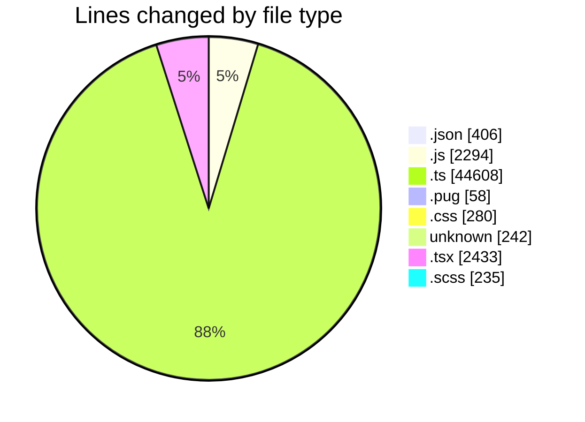
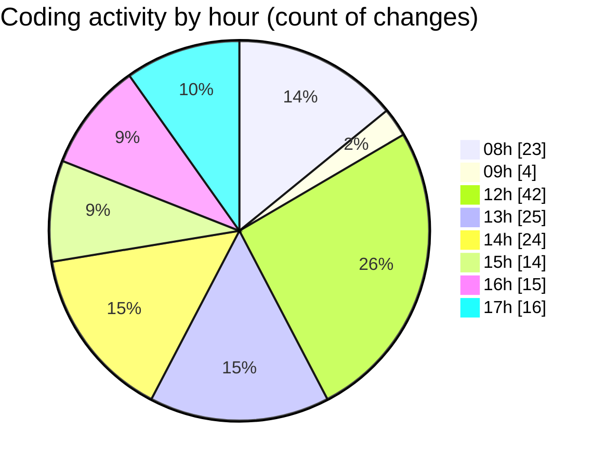

# cda - Activity Summary 

## Overall Statistics

| Stat                   | Value                                                             |
| ---------------------- | ----------------------------------------------------------------- |
| **Lines Added** (➕)   | 50360                                          |
| **Lines Removed** (➖) | 196                                        |
| **Net Change** (↕)    | 50164                |
| **Active Time** (⌚)   | 197 minutes |

## Modified Files
- **lambda.json** (+187, -0)
- **20250814161854-replace-it-kit-people-end-date-view.js** (+33, -0)
- **RecipientsList.test.ts** (+579, -0)
- **recordEmailSentToUsers.test.ts** (+219, -0)
- **RecipientsList.test.ts** (+176, -0)
- **RecipientsList.ts** (+80, -0)
- **Controller.ts** (+74, -0)
- **package.json** (+32, -0)
- **html.pug** (+58, -0)
- **batchSnsMessages.ts** (+60, -0)
- **style.css** (+280, -0)
- **skill-queries.ts** (+118, -0)
- **SkillGroups.test.ts** (+140, -0)
- **skill-group-queries.ts** (+149, -0)
- **SkillGroups.ts** (+137, -12)
- **skills.ts** (+553, -2)
- **skill-group-mutations.ts** (+156, -0)
- **skills.js** (+96, -0)
- **skills.js** (+810, -11)
- **skill-queries.ts** (+865, -14)
- **skill-mutations.ts** (+2290, -33)
- **resolvers-types.ts** (+23500, -0)
- **resolvers-types.ts** (+15383, -0)
- **package.json** (+69, -0)
- **settings.json** (+30, -0)
- **.env** (+242, -0)
- **queries.js** (+237, -37)
- **queries.js** (+339, -0)
- **mutations.js** (+707, -0)
- **ManageGroupsTab.tsx** (+675, -7)
- **ManageGroupsTab.scss** (+18, -8)
- **SkillAdmin.test.tsx** (+223, -1)
- **codegen.ts** (+56, -0)
- **ManageGroupsTab.test.tsx** (+109, -0)
- **SkillAdmin.tsx** (+120, -0)
- **ManageGroupsV2Tab.tsx** (+134, -10)
- **ManageGroupsV2Tab.scss** (+6, -0)
- **index.ts** (+4, -0)
- **ManageGroupDetails.tsx** (+364, -37)
- **ManageGroupDetails.scss** (+181, -22)
- **index.ts** (+4, -0)
- **App.tsx** (+219, -0)
- **ManageGroupsV2Tab.test.tsx** (+48, -0)
- **ManageGroupDetails.test.tsx** (+77, -0)
- **ManageSkillsTab.tsx** (+111, -0)
- **SkillTopicUsers.tsx** (+230, -0)
- **TagUserOverview.tsx** (+66, -2)
- **index.ts** (+4, -0)
- **20260529085728-create-profile-skill-group-table.js** (+24, -0)
- **settings.json** (+88, -0)

## Visualizations

### By File Type (Lines Changed)

### By Hour (Estimated Activity Count)

> **Last Updated:** 02/06/2026, 17:49:02