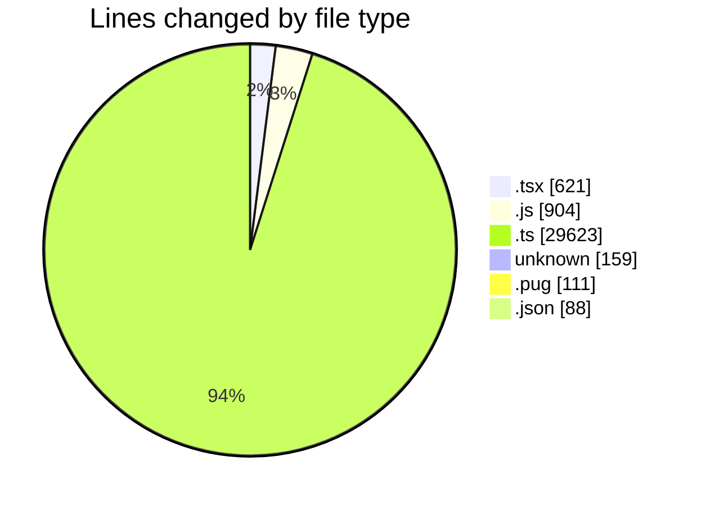
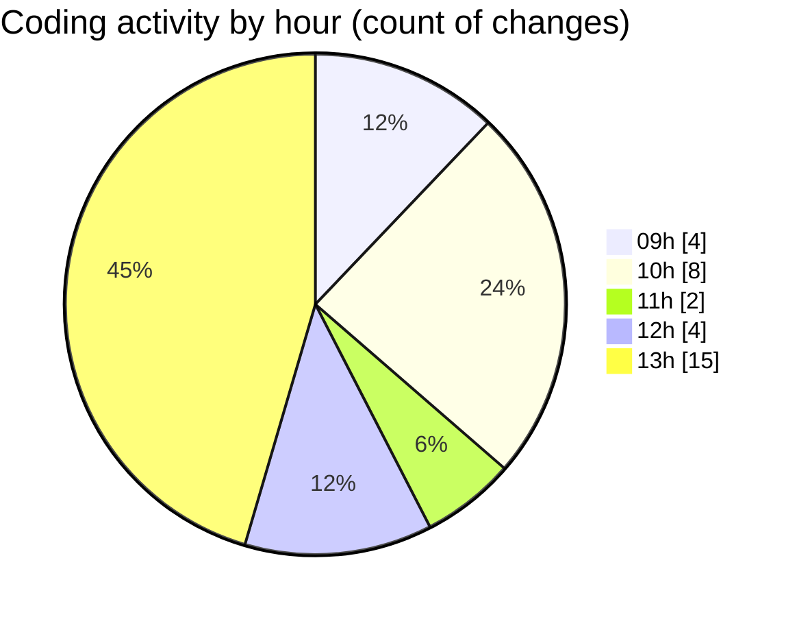

# cda - Activity Summary 

## Overall Statistics

| Stat                   | Value                                                             |
| ---------------------- | ----------------------------------------------------------------- |
| **Lines Added** (➕)   | 31449                                          |
| **Lines Removed** (➖) | 57                                        |
| **Net Change** (↕)    | 31392                |
| **Active Time** (⌚)   | 25 minutes |

## Modified Files
- **ManageGroupsTab.tsx** (+354, -0)
- **queries.js** (+0, -54)
- **App.tsx** (+217, -0)
- **SkillAdmin.tsx** (+50, -0)
- **skills.ts** (+521, -0)
- **skills.js** (+754, -0)
- **.env** (+121, -0)
- **html.pug** (+108, -3)
- **settings.json** (+88, -0)
- **cert** (+38, -0)
- **run.js** (+96, -0)
- **skill-mutations.ts** (+765, -0)
- **tables.ts** (+6755, -0)
- **skill-queries.ts** (+299, -0)
- **resolvers-types.ts** (+11755, -0)
- **views.ts** (+9528, -0)

## Visualizations

### By File Type (Lines Changed)

### By Hour (Estimated Activity Count)

> **Last Updated:** 03/06/2026, 13:11:39