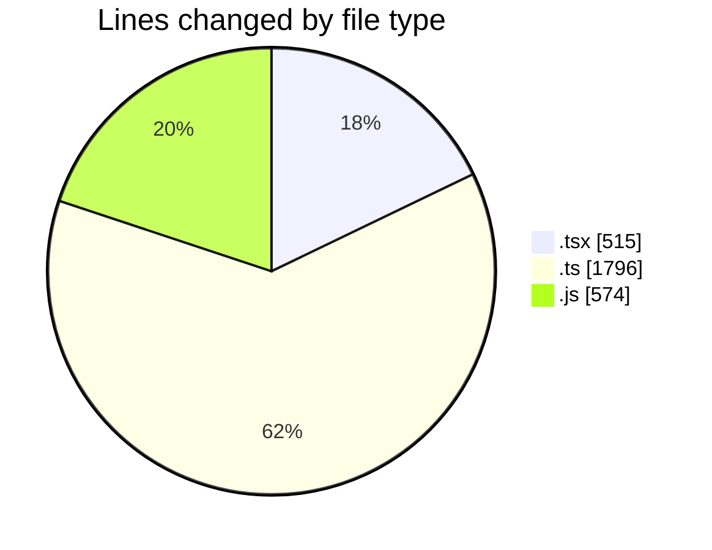
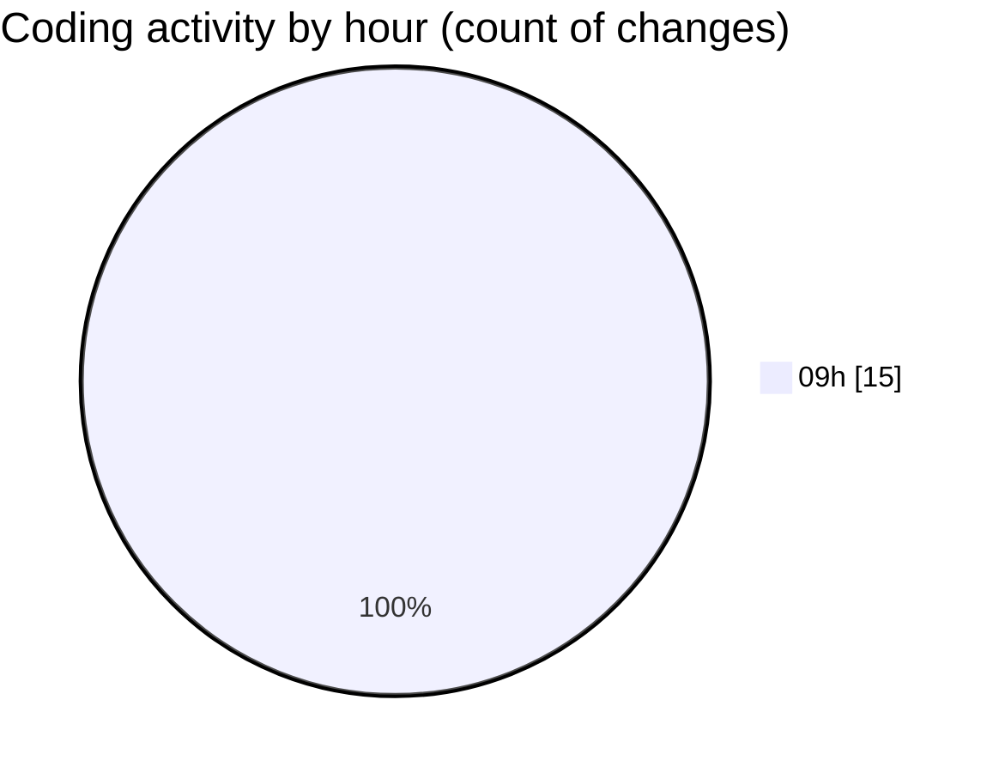

# cda - Activity Summary 

## Overall Statistics

| Stat                   | Value                                                             |
| ---------------------- | ----------------------------------------------------------------- |
| **Lines Added** (➕)   | 2885                                          |
| **Lines Removed** (➖) | 0                                        |
| **Net Change** (↕)    | 2885                |
| **Active Time** (⌚)   | 13 minutes |

## Modified Files
- **SkillAdmin.tsx** (+60, -0)
- **ManageGroupsTab.tsx** (+344, -0)
- **index.ts** (+4, -0)
- **SkillAdmin.test.tsx** (+111, -0)
- **skills.js** (+48, -0)
- **queries.js** (+100, -0)
- **skill-queries.ts** (+59, -0)
- **codegen.ts** (+28, -0)
- **20260529085728-create-profile-skill-group-table.js** (+24, -0)
- **skills.js** (+402, -0)
- **skills.ts** (+277, -0)
- **skill-mutations.ts** (+778, -0)
- **skill-queries.ts** (+299, -0)
- **SkillGroups.ts** (+75, -0)
- **SkillGroups.test.ts** (+276, -0)

## Visualizations

### By File Type (Lines Changed)

### By Hour (Estimated Activity Count)

> **Last Updated:** 04/06/2026, 09:36:09