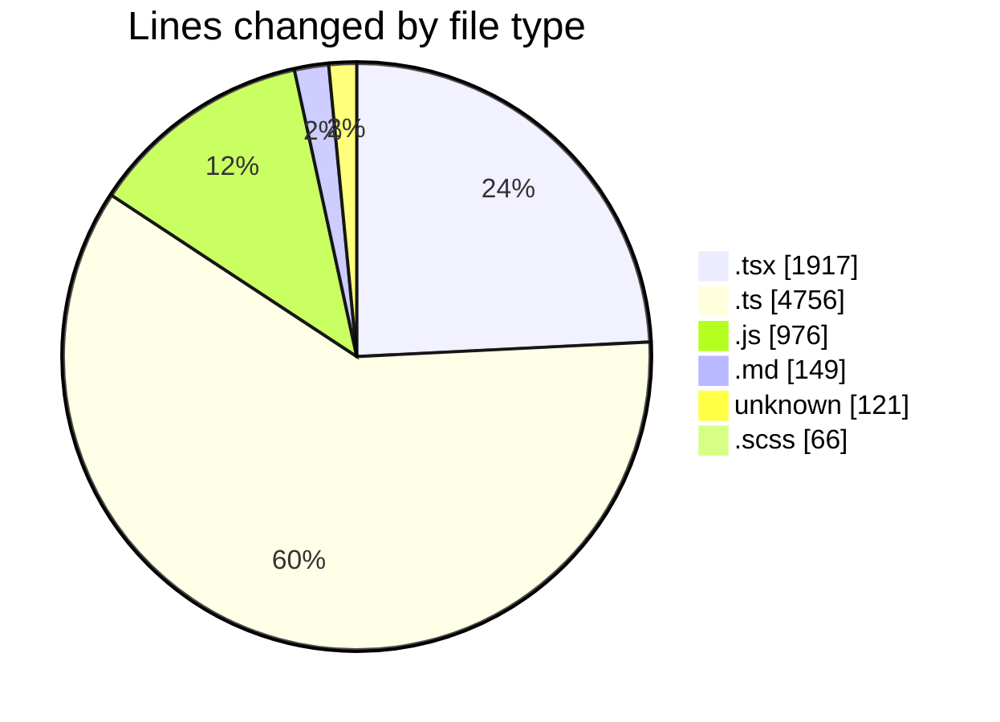
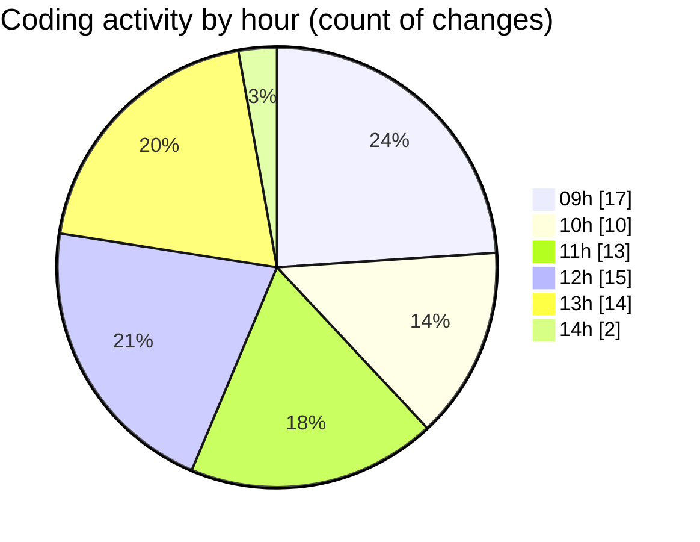

# cda - Activity Summary 

## Overall Statistics

| Stat                   | Value                                                             |
| ---------------------- | ----------------------------------------------------------------- |
| **Lines Added** (➕)   | 7517                                          |
| **Lines Removed** (➖) | 468                                        |
| **Net Change** (↕)    | 7049                |
| **Active Time** (⌚)   | 64 minutes |

## Modified Files
- **SkillAdmin.tsx** (+132, -0)
- **ManageGroupsTab.tsx** (+344, -0)
- **index.ts** (+4, -0)
- **SkillAdmin.test.tsx** (+223, -0)
- **skills.js** (+48, -0)
- **queries.js** (+100, -0)
- **skill-queries.ts** (+59, -0)
- **codegen.ts** (+28, -0)
- **20260529085728-create-profile-skill-group-table.js** (+24, -0)
- **skills.js** (+804, -0)
- **skills.ts** (+554, -0)
- **skill-mutations.ts** (+1782, -225)
- **skill-queries.ts** (+598, -0)
- **SkillGroups.ts** (+168, -0)
- **SkillGroups.test.ts** (+709, -19)
- **group-creation-component-pattern-brief.md** (+149, -0)
- **.env** (+121, -0)
- **App.tsx** (+221, -2)
- **GroupService.ts** (+606, -0)
- **ManageGroupsV2Tab.tsx** (+275, -151)
- **ManageGroupsV2Tab.scss** (+24, -18)
- **ManageGroupsV3Tab.tsx** (+275, -53)
- **ManageGroupsV3Tab.scss** (+24, -0)
- **index.ts** (+4, -0)
- **ManageGroupsV3Tab.test.tsx** (+49, -0)
- **Group.tsx** (+192, -0)

## Visualizations

### By File Type (Lines Changed)

### By Hour (Estimated Activity Count)

> **Last Updated:** 04/06/2026, 14:50:12