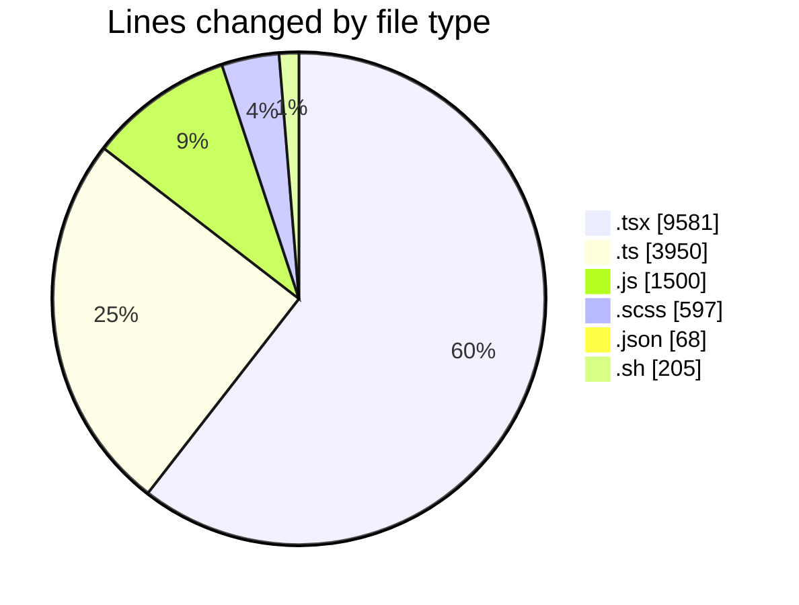
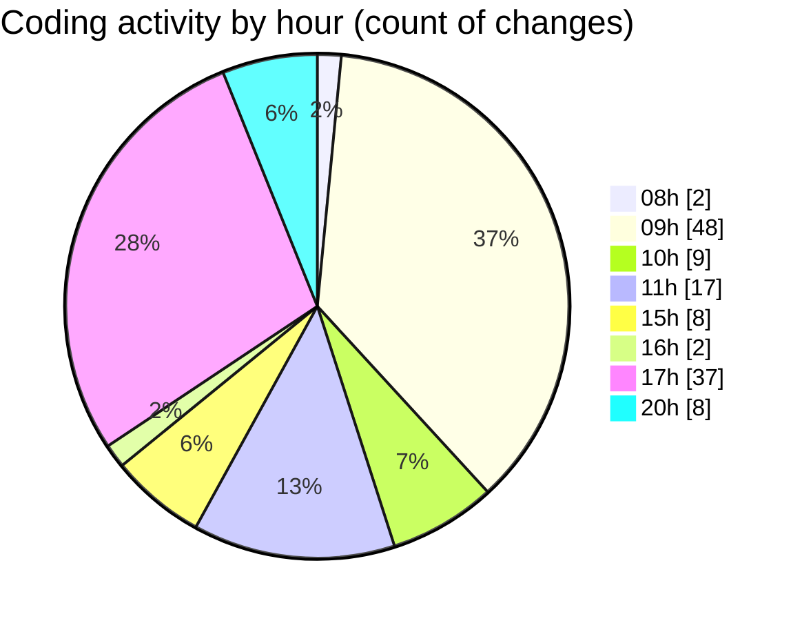

# cda - Activity Summary 

## Overall Statistics

| Stat                   | Value                                                             |
| ---------------------- | ----------------------------------------------------------------- |
| **Lines Added** (➕)   | 13945                                          |
| **Lines Removed** (➖) | 1956                                        |
| **Net Change** (↕)    | 11989                |
| **Active Time** (⌚)   | 140 minutes |

## Modified Files
- **Group.tsx** (+192, -10)
- **SkillAdmin.tsx** (+166, -22)
- **ManageGroupsTab.tsx** (+688, -0)
- **index.ts** (+8, -0)
- **SkillAdmin.test.tsx** (+224, -42)
- **codegen.ts** (+56, -0)
- **queries.js** (+200, -0)
- **skills.js** (+96, -0)
- **skill-queries.ts** (+118, -0)
- **20260529085728-create-profile-skill-group-table.js** (+48, -0)
- **skills.js** (+804, -0)
- **skills.ts** (+554, -0)
- **skill-mutations.ts** (+1558, -0)
- **skill-queries.ts** (+598, -0)
- **SkillGroups.ts** (+186, -0)
- **SkillGroups.test.ts** (+828, -0)
- **ManageGroupsV2Tab.tsx** (+248, -0)
- **ManageGroupsV2Tab.scss** (+12, -0)
- **ManageGroupsV3Tab.tsx** (+416, -0)
- **ManageGroupsV3Tab.scss** (+28, -0)
- **index.ts** (+8, -0)
- **ManageGroupsV3Tab.test.tsx** (+104, -0)
- **SortableDataTable.tsx** (+188, -0)
- **index.ts** (+8, -0)
- **SortableDataTable.scss** (+10, -0)
- **GroupMembersList.tsx** (+420, -0)
- **GroupMembersList.scss** (+20, -0)
- **ManageGroupDetails.tsx** (+528, -0)
- **ManageGroupDetails.test.tsx** (+154, -0)
- **GroupManagment.tsx** (+186, -3)
- **index.ts** (+15, -9)
- **GroupManagement.tsx** (+1176, -946)
- **GroupManagement.scss** (+328, -194)
- **GroupManagement.stories.tsx** (+636, -506)
- **SortableDataTable.tsx** (+95, -0)
- **SortableDataTable.scss** (+5, -0)
- **index.ts** (+4, -0)
- **index.js** (+350, -2)
- **GroupManagementComponent.tsx** (+422, -189)
- **SearchResults.tsx** (+270, -0)
- **App.tsx** (+219, -0)
- **NewGroup.tsx** (+531, -0)
- **NewGroupPanel.tsx** (+386, -0)
- **package.json** (+68, -0)
- **CreateBooking.tsx** (+147, -10)
- **Book.test.tsx** (+457, -0)
- **stream.sh** (+182, -23)

## Visualizations

### By File Type (Lines Changed)

### By Hour (Estimated Activity Count)

> **Last Updated:** 10/06/2026, 20:39:14