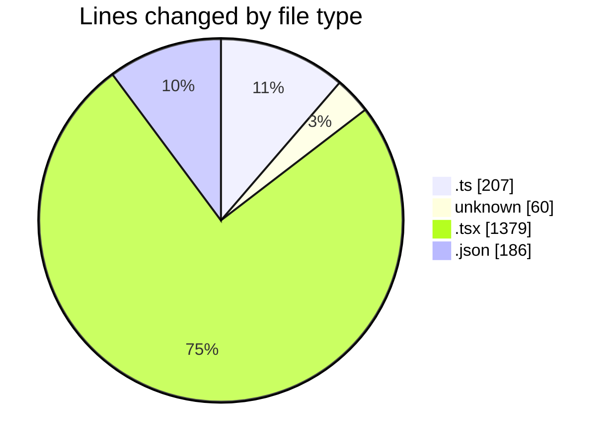
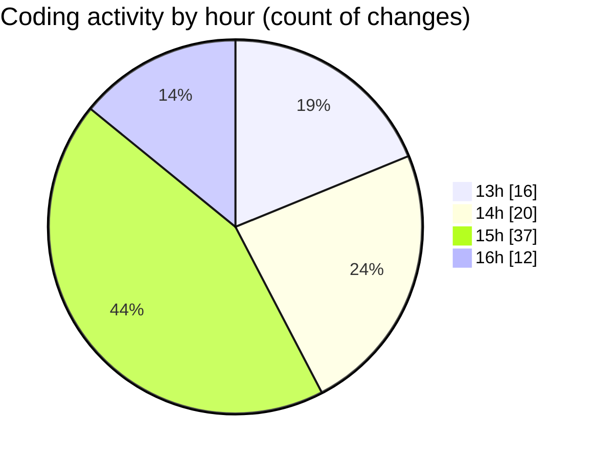

# cda - Activity Summary 

## Overall Statistics

| Stat                   | Value                                                             |
| ---------------------- | ----------------------------------------------------------------- |
| **Lines Added** (➕)   | 1063                                          |
| **Lines Removed** (➖) | 769                                        |
| **Net Change** (↕)    | 294                |
| **Active Time** (⌚)   | 143 minutes |

## Modified Files
- **storyData.ts** (+14, -10)
- **.gitignore** (+60, -0)
- **useStorySearch.ts** (+4, -7)
- **GroupManagement.stories.tsx** (+355, -344)
- **GroupManagement.tsx** (+15, -140)
- **GroupManagement.test.tsx** (+194, -268)
- **package.json** (+186, -0)
- **useGroupManagementState.ts** (+172, -0)
- **useGroupManagementState.test.tsx** (+63, -0)

## Visualizations

### By File Type (Lines Changed)

### By Hour (Estimated Activity Count)

> **Last Updated:** 12/06/2026, 16:59:05