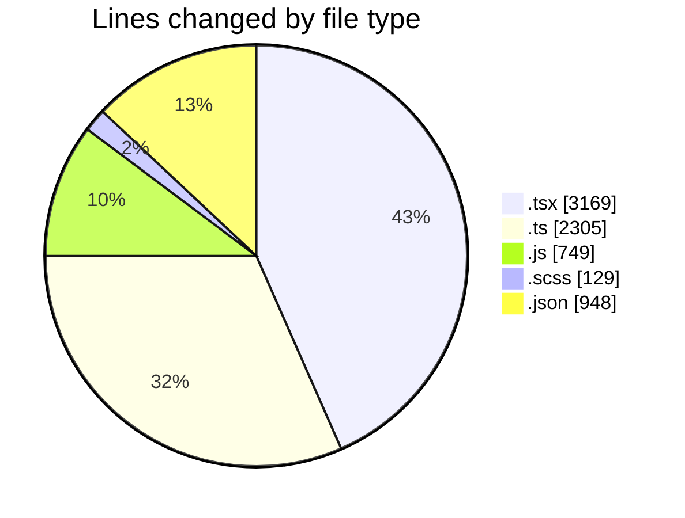
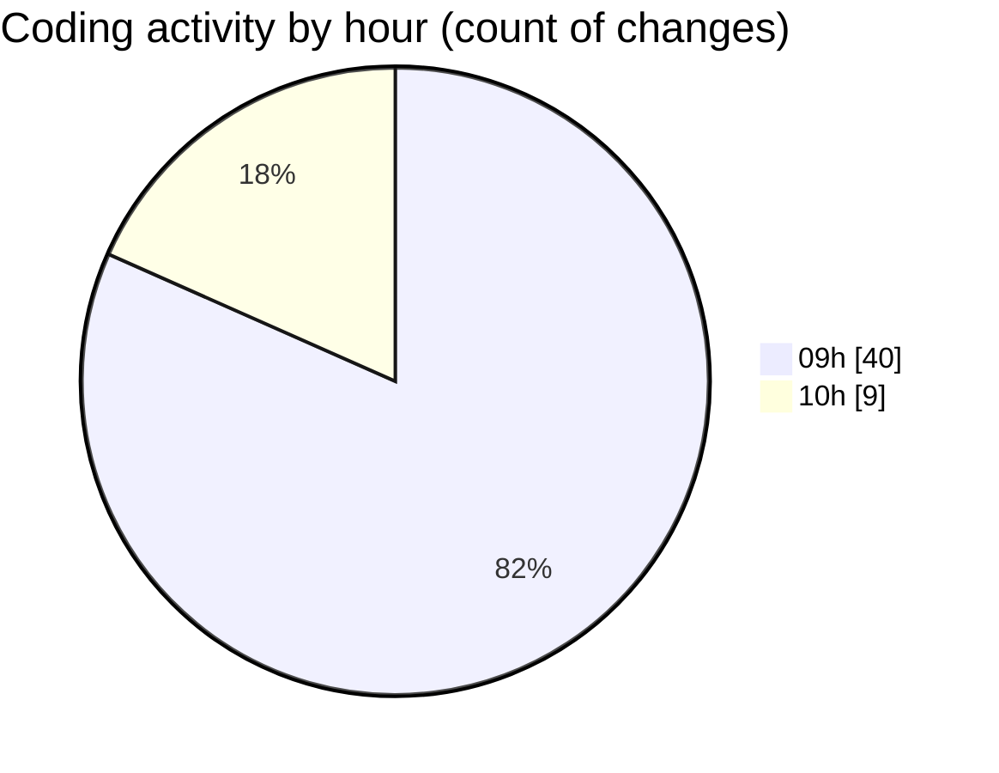

# cda - Activity Summary 

## Overall Statistics

| Stat                   | Value                                                             |
| ---------------------- | ----------------------------------------------------------------- |
| **Lines Added** (➕)   | 7278                                          |
| **Lines Removed** (➖) | 22                                        |
| **Net Change** (↕)    | 7256                |
| **Active Time** (⌚)   | 46 minutes |

## Modified Files
- **SkillAdmin.tsx** (+72, -0)
- **ManageGroupsTab.tsx** (+344, -0)
- **index.ts** (+4, -0)
- **SkillAdmin.test.tsx** (+112, -0)
- **skills.js** (+48, -0)
- **queries.js** (+100, -0)
- **codegen.ts** (+28, -0)
- **skill-queries.ts** (+59, -0)
- **20260529085728-create-profile-skill-group-table.js** (+24, -0)
- **skills.js** (+402, -0)
- **skills.ts** (+277, -0)
- **skill-mutations.ts** (+779, -0)
- **skill-queries.ts** (+299, -0)
- **SkillGroups.ts** (+93, -0)
- **SkillGroups.test.ts** (+414, -0)
- **ManageGroupsV2Tab.tsx** (+124, -0)
- **ManageGroupsV3Tab.tsx** (+208, -0)
- **ManageGroupsV2Tab.scss** (+6, -0)
- **ManageGroupsV3Tab.scss** (+14, -0)
- **SortableDataTable.tsx** (+94, -0)
- **ManageGroupsV3Tab.test.tsx** (+52, -0)
- **index.ts** (+4, -0)
- **SortableDataTable.scss** (+5, -0)
- **index.ts** (+4, -0)
- **GroupMembersList.tsx** (+210, -0)
- **ManageGroupDetails.tsx** (+264, -0)
- **GroupMembersList.scss** (+10, -0)
- **ManageGroupDetails.test.tsx** (+77, -0)
- **GroupManagement.scss** (+94, -0)
- **index.ts** (+12, -0)
- **GroupManagement.stories.tsx** (+314, -0)
- **index.js** (+175, -0)
- **GroupManagement.tsx** (+358, -0)
- **MultiSelect.tsx** (+292, -0)
- **GroupManagement.test.tsx** (+315, -0)
- **SearchResults.tsx** (+270, -0)
- **useStorySearch.ts** (+39, -0)
- **storyData.ts** (+121, -0)
- **useGroupManagementState.ts** (+172, -0)
- **useGroupManagementState.test.tsx** (+63, -0)
- **settings.json** (+31, -0)
- **.claude.json** (+895, -22)

## Visualizations

### By File Type (Lines Changed)

### By Hour (Estimated Activity Count)

> **Last Updated:** 15/06/2026, 10:48:18