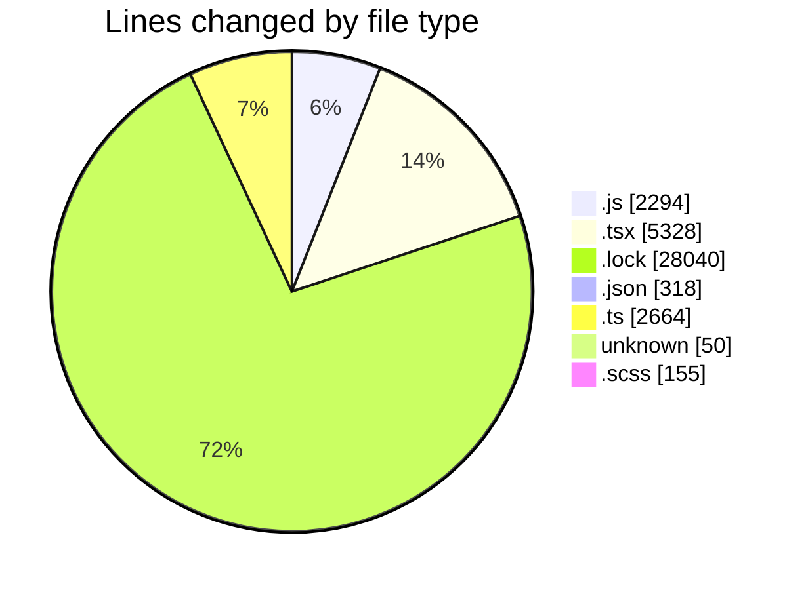
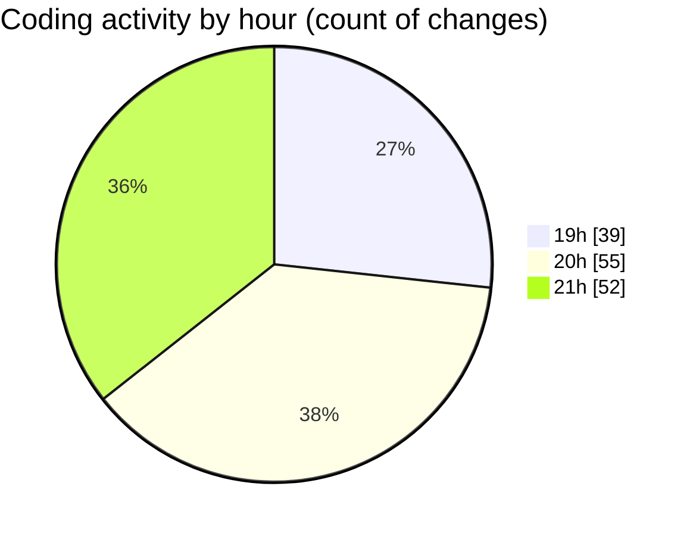

# cda - Activity Summary 

## Overall Statistics

| Stat                   | Value                                                             |
| ---------------------- | ----------------------------------------------------------------- |
| **Lines Added** (➕)   | 38135                                          |
| **Lines Removed** (➖) | 714                                        |
| **Net Change** (↕)    | 37421                |
| **Active Time** (⌚)   | 194 minutes |

## Modified Files
- **index.js** (+366, -20)
- **CreateBooking.tsx** (+144, -2)
- **queries.js** (+462, -108)
- **SkillAdmin.tsx** (+122, -22)
- **SkillAdmin.test.tsx** (+212, -42)
- **App.tsx** (+476, -13)
- **yarn.lock** (+13854, -0)
- **package.json** (+68, -0)
- **Book.test.tsx** (+457, -0)
- **index.ts** (+14, -11)
- **index.ts** (+507, -0)
- **useStorySearch.ts** (+39, -0)
- **storyData.ts** (+121, -3)
- **GroupManagement.stories.tsx** (+333, -68)
- **useGroupManagementState.test.tsx** (+69, -0)
- **index.ts** (+4, -0)
- **GroupDetails.tsx** (+528, -20)
- **index.ts** (+4, -1)
- **GroupCreate.test.tsx** (+209, -131)
- **GroupCreate.tsx** (+576, -226)
- **.gitignore** (+50, -0)
- **mutations.js** (+707, -0)
- **Group.tsx** (+196, -7)
- **package.json** (+186, -0)
- **package.json** (+64, -0)
- **yarn.lock** (+14186, -0)
- **index.ts** (+4, -0)
- **GroupDetails.tsx** (+264, -0)
- **GroupDetails.scss** (+150, -0)
- **GroupDetails.test.tsx** (+78, -14)
- **GroupMembersList.tsx** (+210, -0)
- **skills.js** (+48, -0)
- **codegen.ts** (+28, -0)
- **queries.js** (+100, -0)
- **skill-queries.ts** (+59, -0)
- **20260529085728-create-profile-skill-group-table.js** (+24, -0)
- **skills.js** (+402, -0)
- **skills.ts** (+277, -0)
- **skill-mutations.ts** (+779, -0)
- **skill-queries.ts** (+299, -0)
- **SkillGroups.ts** (+93, -0)
- **SkillGroups.test.ts** (+414, -0)
- **index.ts** (+4, -0)
- **SortableDataTable.scss** (+5, -0)
- **SortableDataTable.tsx** (+94, -0)
- **index.js** (+57, -0)
- **SearchResults.tsx** (+270, -0)
- **MultiSelect.tsx** (+292, -0)
- **Groups.test.tsx** (+80, -13)
- **index.ts** (+3, -0)
- **Groups.tsx** (+147, -13)

## Visualizations

### By File Type (Lines Changed)

### By Hour (Estimated Activity Count)

> **Last Updated:** 16/06/2026, 21:29:50