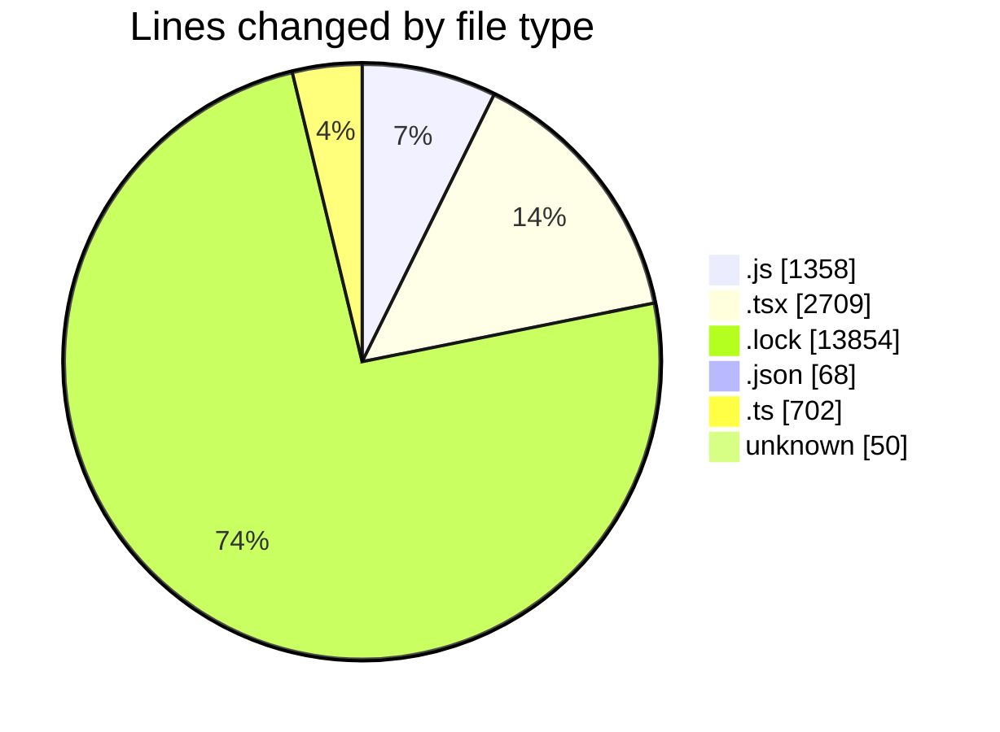
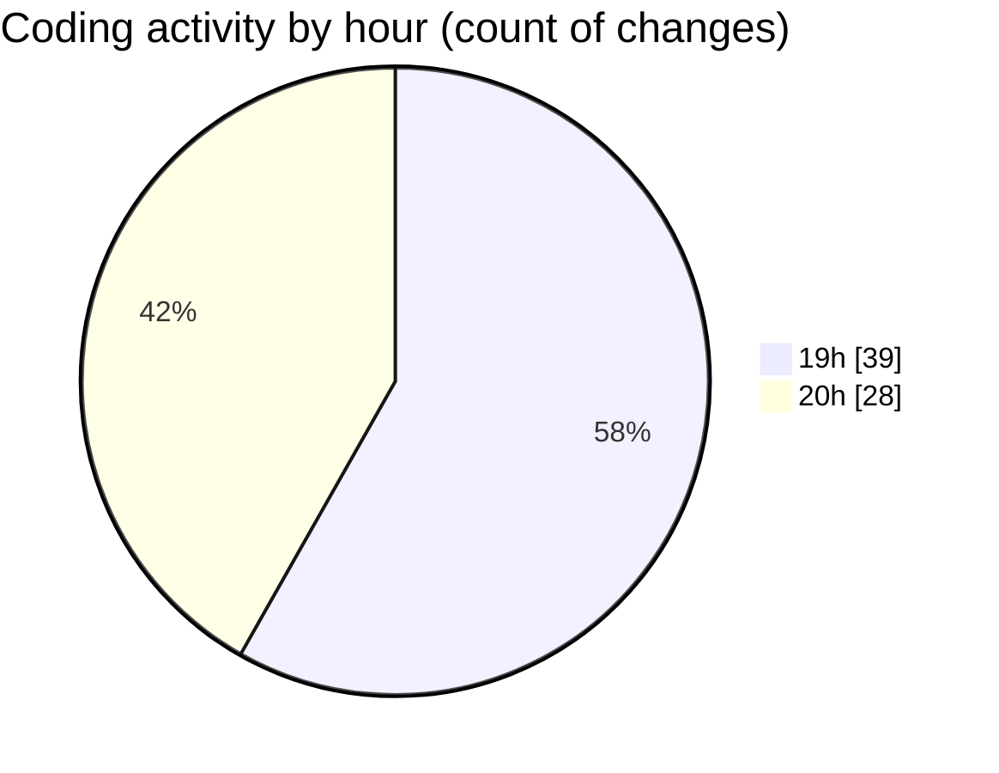

# cda - Activity Summary 

## Overall Statistics

| Stat                   | Value                                                             |
| ---------------------- | ----------------------------------------------------------------- |
| **Lines Added** (➕)   | 18178                                          |
| **Lines Removed** (➖) | 563                                        |
| **Net Change** (↕)    | 17615                |
| **Active Time** (⌚)   | 96 minutes |

## Modified Files
- **index.js** (+181, -8)
- **CreateBooking.tsx** (+144, -2)
- **queries.js** (+408, -54)
- **SkillAdmin.tsx** (+72, -22)
- **SkillAdmin.test.tsx** (+112, -42)
- **App.tsx** (+227, -5)
- **yarn.lock** (+13854, -0)
- **package.json** (+68, -0)
- **Book.test.tsx** (+457, -0)
- **index.ts** (+14, -11)
- **index.ts** (+507, -0)
- **useStorySearch.ts** (+39, -0)
- **storyData.ts** (+121, -3)
- **GroupManagement.stories.tsx** (+333, -68)
- **useGroupManagementState.test.tsx** (+69, -0)
- **index.ts** (+4, -0)
- **GroupDetails.tsx** (+264, -0)
- **index.ts** (+3, -0)
- **GroupCreate.test.tsx** (+131, -130)
- **GroupCreate.tsx** (+224, -218)
- **.gitignore** (+50, -0)
- **mutations.js** (+707, -0)
- **Group.tsx** (+189, -0)

## Visualizations

### By File Type (Lines Changed)

### By Hour (Estimated Activity Count)

> **Last Updated:** 16/06/2026, 20:22:58