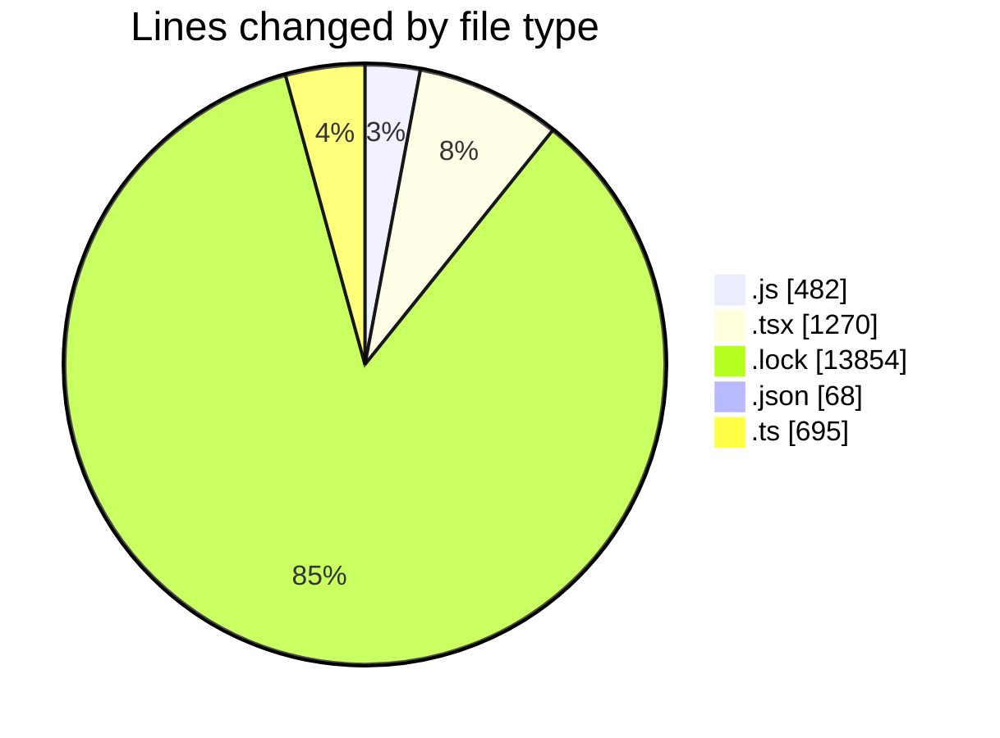

# cda - Activity Summary 

## Overall Statistics

| Stat                   | Value                                                             |
| ---------------------- | ----------------------------------------------------------------- |
| **Lines Added** (➕)   | 16348                                          |
| **Lines Removed** (➖) | 21                                        |
| **Net Change** (↕)    | 16327                |
| **Active Time** (⌚)   | 41 minutes |

## Modified Files
- **index.js** (+179, -3)
- **CreateBooking.tsx** (+144, -2)
- **queries.js** (+300, -0)
- **SkillAdmin.tsx** (+50, -0)
- **SkillAdmin.test.tsx** (+70, -0)
- **App.tsx** (+217, -0)
- **yarn.lock** (+13854, -0)
- **package.json** (+68, -0)
- **Book.test.tsx** (+457, -0)
- **index.ts** (+14, -11)
- **index.ts** (+507, -0)
- **useStorySearch.ts** (+39, -0)
- **storyData.ts** (+121, -3)
- **GroupManagement.stories.tsx** (+328, -2)

## Visualizations

### By File Type (Lines Changed)

### By Hour (Estimated Activity Count)

> **Last Updated:** 16/06/2026, 19:37:58