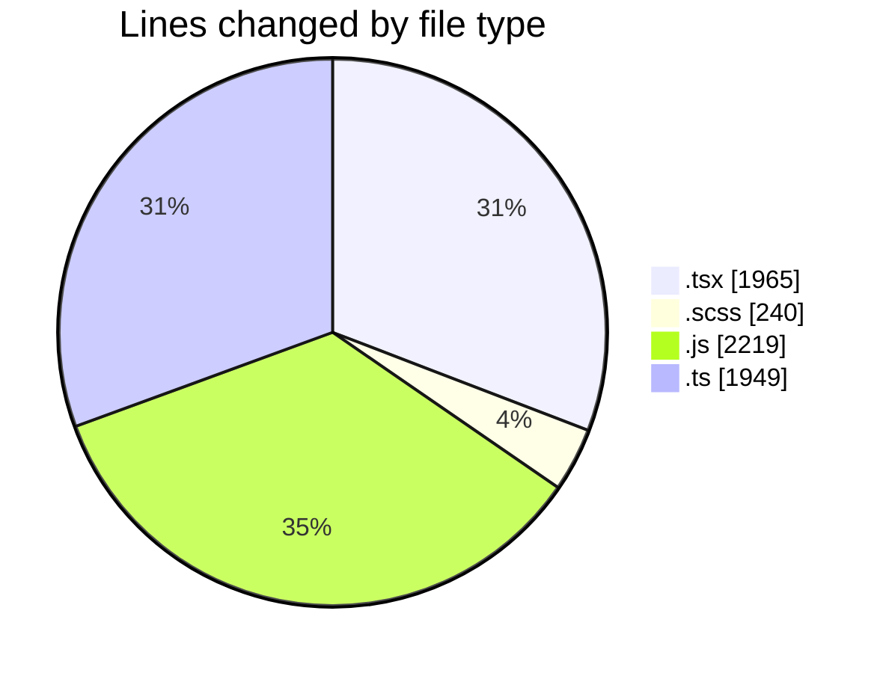
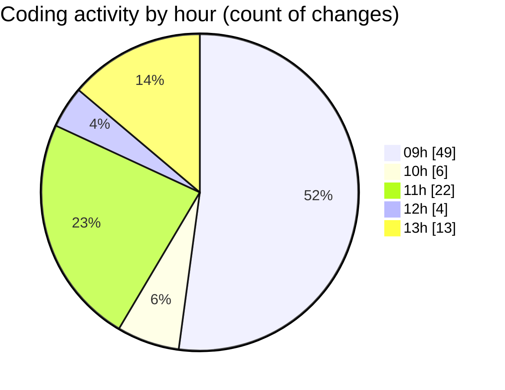

# cda - Activity Summary 

## Overall Statistics

| Stat                   | Value                                                             |
| ---------------------- | ----------------------------------------------------------------- |
| **Lines Added** (➕)   | 6109                                          |
| **Lines Removed** (➖) | 264                                        |
| **Net Change** (↕)    | 5845                |
| **Active Time** (⌚)   | 142 minutes |

## Modified Files
- **GroupCreate.tsx** (+11, -17)
- **SortableDataTable.tsx** (+94, -0)
- **GroupMembersList.scss** (+18, -6)
- **ConfirmationModal.tsx** (+181, -31)
- **GroupMembersList.tsx** (+2, -1)
- **ConfirmationModal.scss** (+81, -80)
- **SortableDataTable.scss** (+37, -18)
- **GroupCreate.test.tsx** (+0, -2)
- **Group.tsx** (+189, -0)
- **SkillAdmin.test.tsx** (+100, -30)
- **App.tsx** (+293, -73)
- **allocate.js** (+1066, -0)
- **allocate.js** (+337, -0)
- **SkillAdmin.tsx** (+50, -0)
- **queries.js** (+100, -0)
- **skills.js** (+48, -0)
- **codegen.ts** (+28, -0)
- **skill-queries.ts** (+59, -0)
- **20260529085728-create-profile-skill-group-table.js** (+24, -0)
- **skills.js** (+402, -0)
- **skills.ts** (+277, -0)
- **skill-mutations.ts** (+779, -0)
- **skill-queries.ts** (+299, -0)
- **SkillGroups.ts** (+93, -0)
- **SkillGroups.test.ts** (+414, -0)
- **index.js** (+179, -6)
- **MultiSelect.tsx** (+292, -0)
- **SearchResults.tsx** (+270, -0)
- **index.js** (+57, -0)
- **GroupManagement.stories.tsx** (+329, -0)

## Visualizations

### By File Type (Lines Changed)

### By Hour (Estimated Activity Count)

> **Last Updated:** 17/06/2026, 13:53:49