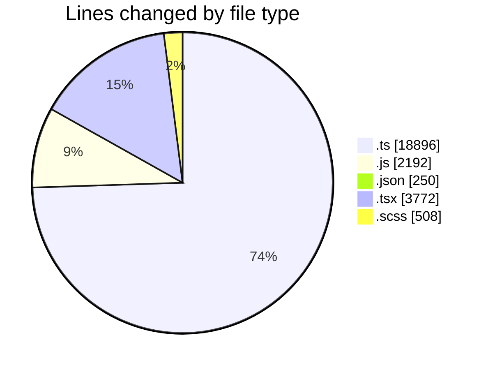
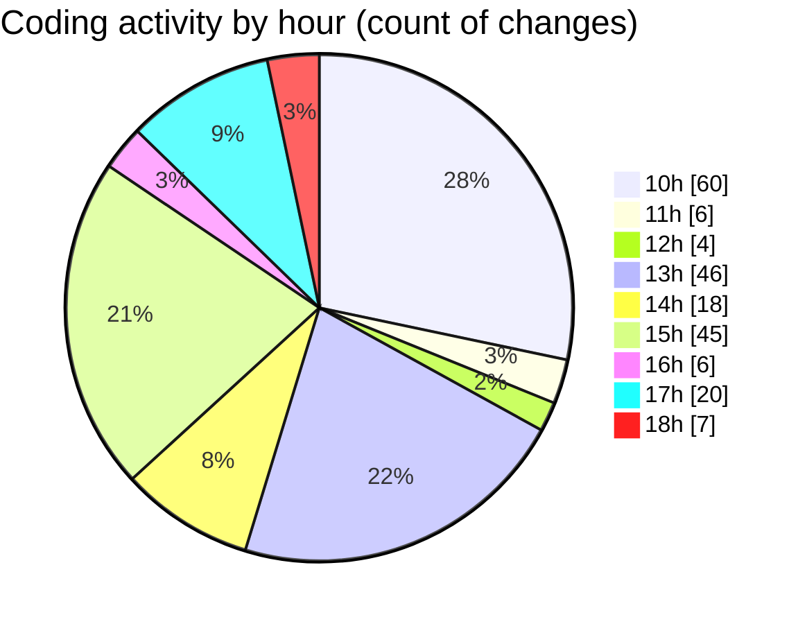

# cda - Activity Summary 

## Overall Statistics

| Stat                   | Value                                                             |
| ---------------------- | ----------------------------------------------------------------- |
| **Lines Added** (➕)   | 25043                                          |
| **Lines Removed** (➖) | 575                                        |
| **Net Change** (↕)    | 24468                |
| **Active Time** (⌚)   | 298 minutes |

## Modified Files
- **index.ts** (+505, -0)
- **index.js** (+176, -3)
- **package.json** (+186, -0)
- **SkillAdmin.tsx** (+50, -0)
- **SkillAdmin.test.tsx** (+100, -15)
- **skills.js** (+48, -0)
- **queries.js** (+100, -0)
- **codegen.ts** (+28, -0)
- **skill-queries.ts** (+59, -0)
- **20260529085728-create-profile-skill-group-table.js** (+24, -0)
- **skills.js** (+402, -0)
- **skills.ts** (+277, -0)
- **skill-mutations.ts** (+779, -0)
- **skill-queries.ts** (+299, -0)
- **SkillGroups.ts** (+93, -0)
- **SkillGroups.test.ts** (+414, -0)
- **MultiSelect.tsx** (+292, -0)
- **SearchResults.tsx** (+270, -0)
- **index.js** (+57, -0)
- **App.tsx** (+274, -29)
- **ConfirmationModal.tsx** (+93, -12)
- **SortableItem.tsx** (+41, -0)
- **SortableList.tsx** (+107, -0)
- **SortableDataTable.tsx** (+94, -0)
- **GroupMembersList.tsx** (+211, -0)
- **Groups.tsx** (+126, -6)
- **GroupDetails.tsx** (+273, -69)
- **Groups.test.tsx** (+49, -0)
- **GroupDetails.test.tsx** (+66, -0)
- **GroupDetails.scss** (+248, -77)
- **GroupEdit.tsx** (+175, -0)
- **index.ts** (+3, -0)
- **GroupCreate.tsx** (+491, -187)
- **mutations.js** (+707, -0)
- **queries.js** (+408, -54)
- **InlineUpdateButton.scss** (+105, -18)
- **GroupManagement.tsx** (+372, -59)
- **types.ts** (+165, -4)
- **index.ts** (+5, -0)
- **GroupManagement.d.ts** (+11, -0)
- **InputField.tsx** (+134, -0)
- **toTItle.ts** (+3, -0)
- **package.json** (+64, -0)
- **types.d.ts** (+124, -0)
- **titleCase.ts** (+14, -0)
- **GroupSearch.tsx** (+175, -2)
- **GroupSearch.scss** (+60, -0)
- **graphql.ts** (+8759, -0)
- **gql.ts** (+268, -0)
- **graphql.ts** (+7086, -0)
- **people.js** (+173, -40)

## Visualizations

### By File Type (Lines Changed)

### By Hour (Estimated Activity Count)

> **Last Updated:** 18/06/2026, 18:10:49