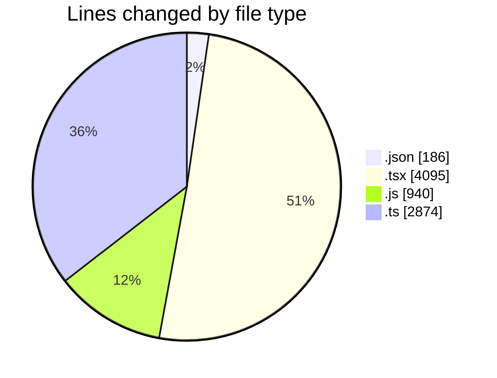
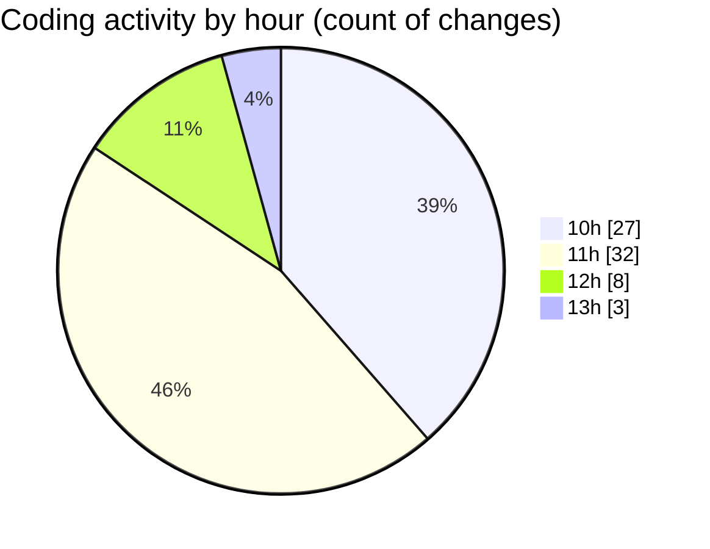

# cda - Activity Summary 

## Overall Statistics

| Stat                   | Value                                                             |
| ---------------------- | ----------------------------------------------------------------- |
| **Lines Added** (➕)   | 7010                                          |
| **Lines Removed** (➖) | 1085                                        |
| **Net Change** (↕)    | 5925                |
| **Active Time** (⌚)   | 80 minutes |

## Modified Files
- **package.json** (+186, -0)
- **GroupManagement.tsx** (+400, -66)
- **SkillAdmin.test.tsx** (+70, -0)
- **SkillAdmin.tsx** (+50, -0)
- **skills.js** (+48, -0)
- **skill-queries.ts** (+59, -0)
- **codegen.ts** (+28, -0)
- **queries.js** (+100, -0)
- **20260529085728-create-profile-skill-group-table.js** (+24, -0)
- **skills.js** (+402, -0)
- **skills.ts** (+277, -0)
- **skill-mutations.ts** (+779, -0)
- **skill-queries.ts** (+299, -0)
- **SkillGroups.ts** (+93, -0)
- **SkillGroups.test.ts** (+414, -0)
- **index.js** (+176, -0)
- **MultiSelect.tsx** (+292, -0)
- **SearchResults.tsx** (+270, -0)
- **index.js** (+57, -0)
- **App.tsx** (+217, -0)
- **ConfirmationModal.tsx** (+69, -0)
- **types.ts** (+197, -5)
- **index.ts** (+16, -0)
- **types.d.ts** (+124, -0)
- **people.js** (+133, -0)
- **storyData.ts** (+213, -13)
- **GroupManagement.stories.tsx** (+414, -64)
- **useGroupManagementState.ts** (+187, -131)
- **GroupSearch.tsx** (+205, -39)
- **GroupMultiSelect.tsx** (+146, -0)
- **GroupManagementTabs.tsx** (+62, -0)
- **useGroupManagementState.test.tsx** (+69, -22)
- **GroupManagement.test.tsx** (+895, -745)
- **useStorySearch.ts** (+39, -0)

## Visualizations

### By File Type (Lines Changed)

### By Hour (Estimated Activity Count)

> **Last Updated:** 14/07/2026, 13:07:32