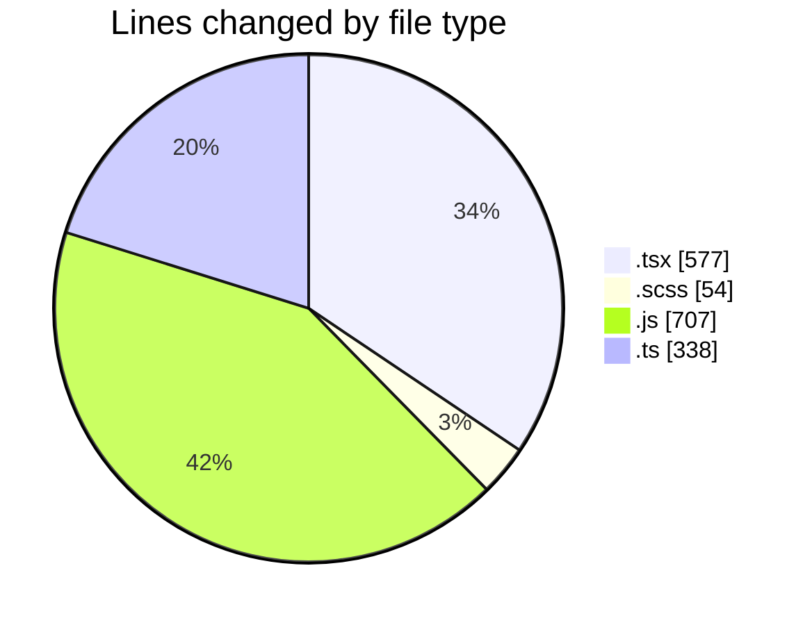
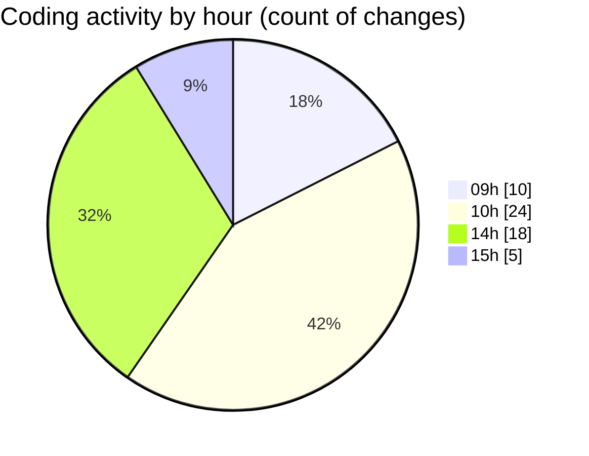

# cda - Activity Summary 

## Overall Statistics

| Stat                   | Value                                                             |
| ---------------------- | ----------------------------------------------------------------- |
| **Lines Added** (➕)   | 1548                                          |
| **Lines Removed** (➖) | 128                                        |
| **Net Change** (↕)    | 1420                |
| **Active Time** (⌚)   | 63 minutes |

## Modified Files
- **GroupMultiSelect.tsx** (+12, -23)
- **Tooltip.test.tsx** (+0, -6)
- **GroupManagement.test.tsx** (+8, -10)
- **GroupManagement.scss** (+25, -29)
- **App.tsx** (+56, -28)
- **SkillAdmin.test.tsx** (+30, -15)
- **ConfirmationModal.tsx** (+24, -12)
- **GroupCreate.tsx** (+348, -5)
- **mutations.js** (+707, -0)
- **skill-mutations.ts** (+10, -0)
- **resolvers-types.ts** (+49, -0)
- **skill-group-mutations.ts** (+279, -0)

## Visualizations

### By File Type (Lines Changed)

### By Hour (Estimated Activity Count)

> **Last Updated:** 21/07/2026, 15:05:07