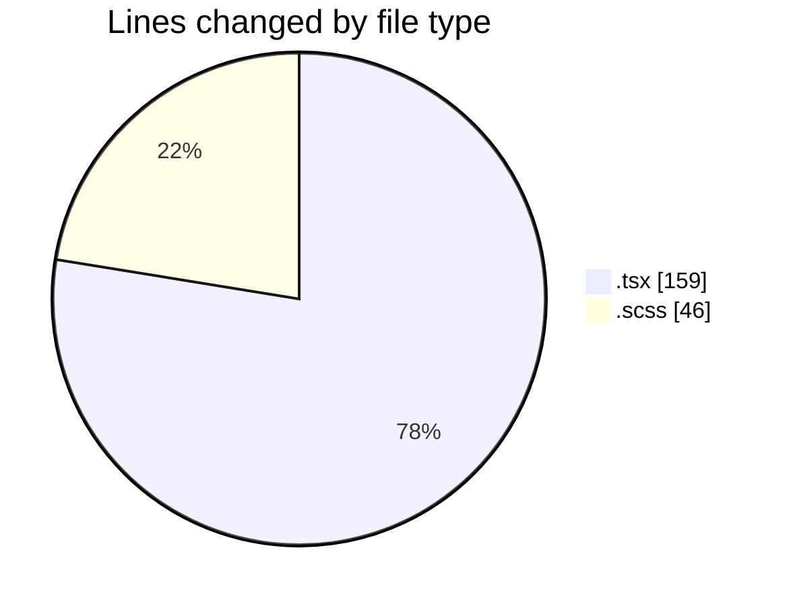
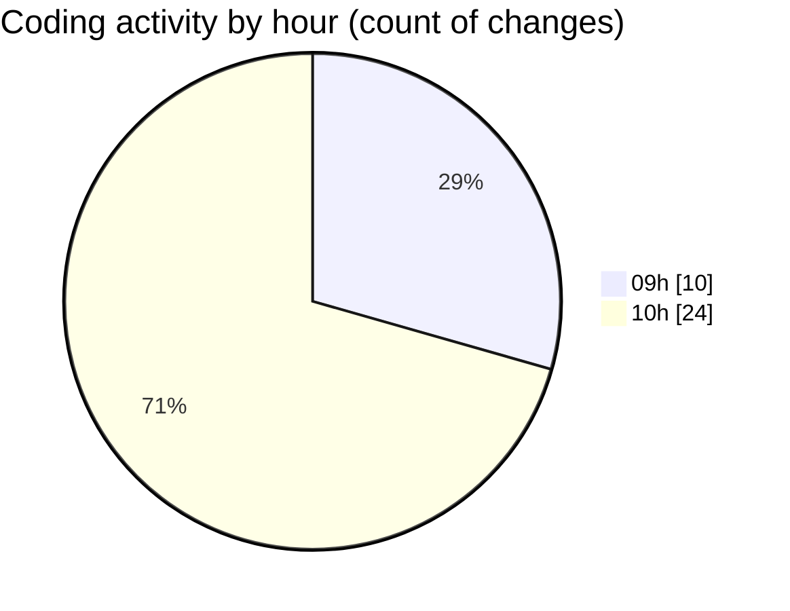

# cda - Activity Summary 

## Overall Statistics

| Stat                   | Value                                                             |
| ---------------------- | ----------------------------------------------------------------- |
| **Lines Added** (➕)   | 91                                          |
| **Lines Removed** (➖) | 114                                        |
| **Net Change** (↕)    | -23                |
| **Active Time** (⌚)   | 36 minutes |

## Modified Files
- **GroupMultiSelect.tsx** (+9, -20)
- **Tooltip.test.tsx** (+0, -6)
- **GroupManagement.test.tsx** (+6, -8)
- **GroupManagement.scss** (+21, -25)
- **App.tsx** (+28, -28)
- **SkillAdmin.test.tsx** (+15, -15)
- **ConfirmationModal.tsx** (+12, -12)

## Visualizations

### By File Type (Lines Changed)

### By Hour (Estimated Activity Count)

> **Last Updated:** 21/07/2026, 10:35:07