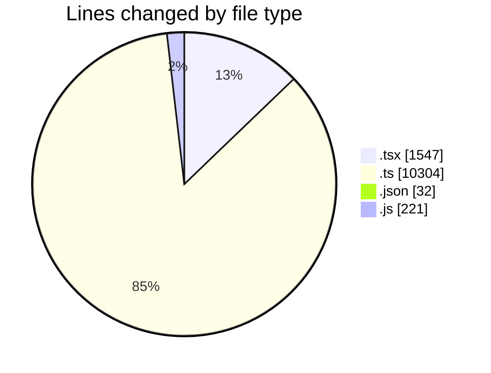
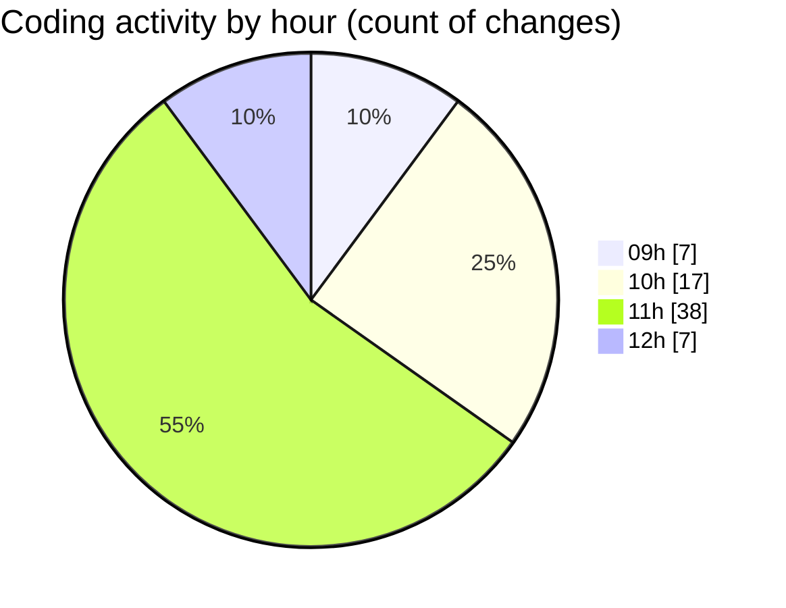

# cda - Activity Summary 

## Overall Statistics

| Stat                   | Value                                                             |
| ---------------------- | ----------------------------------------------------------------- |
| **Lines Added** (➕)   | 11988                                          |
| **Lines Removed** (➖) | 116                                        |
| **Net Change** (↕)    | 11872                |
| **Active Time** (⌚)   | 101 minutes |

## Modified Files
- **GroupCreate.test.tsx** (+177, -23)
- **GroupCreate.tsx** (+738, -35)
- **Groups.test.tsx** (+49, -0)
- **skill-queries.ts** (+346, -10)
- **settings.json** (+32, -0)
- **skills.js** (+15, -0)
- **skill-team-queries.ts** (+902, -21)
- **queries.js** (+179, -27)
- **gql.ts** (+70, -0)
- **graphql.ts** (+8955, -0)
- **GroupDetails.tsx** (+199, -0)
- **GroupMembersList.tsx** (+232, -0)
- **SortableDataTable.tsx** (+94, -0)

## Visualizations

### By File Type (Lines Changed)

### By Hour (Estimated Activity Count)

> **Last Updated:** 22/07/2026, 12:11:58