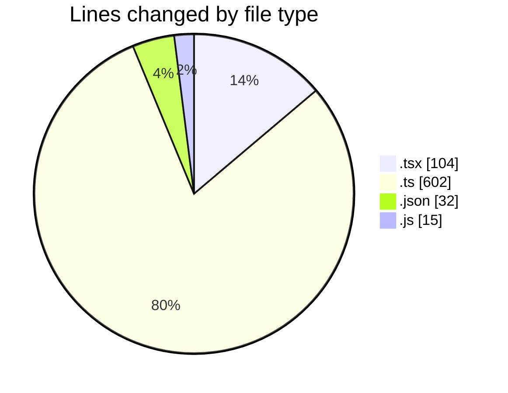
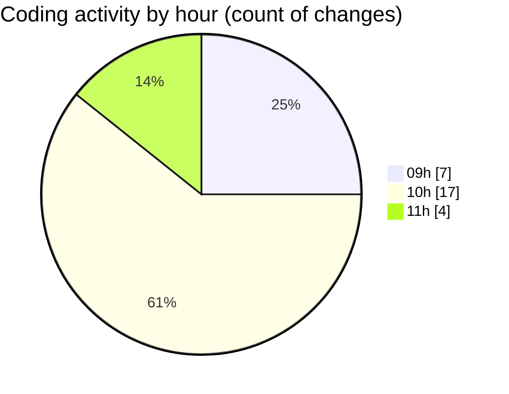

# cda - Activity Summary 

## Overall Statistics

| Stat                   | Value                                                             |
| ---------------------- | ----------------------------------------------------------------- |
| **Lines Added** (➕)   | 697                                          |
| **Lines Removed** (➖) | 56                                        |
| **Net Change** (↕)    | 641                |
| **Active Time** (⌚)   | 38 minutes |

## Modified Files
- **GroupCreate.test.tsx** (+4, -21)
- **GroupCreate.tsx** (+7, -23)
- **Groups.test.tsx** (+49, -0)
- **skill-queries.ts** (+145, -7)
- **settings.json** (+32, -0)
- **skills.js** (+15, -0)
- **skill-team-queries.ts** (+445, -5)

## Visualizations

### By File Type (Lines Changed)

### By Hour (Estimated Activity Count)

> **Last Updated:** 22/07/2026, 11:10:07