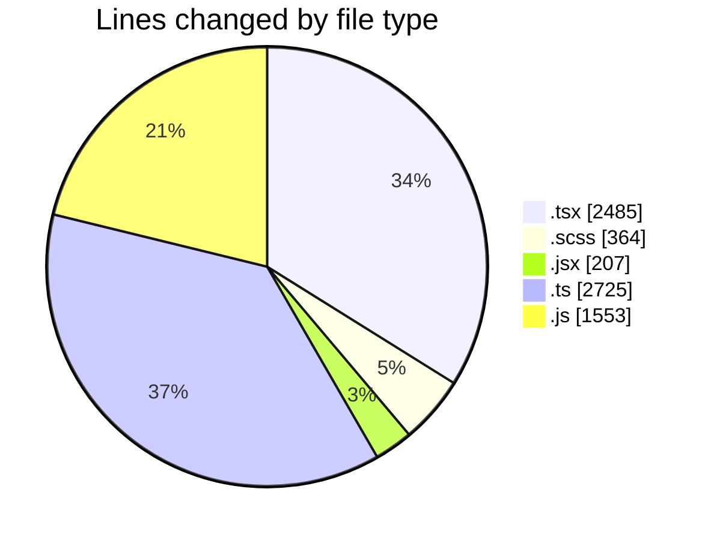
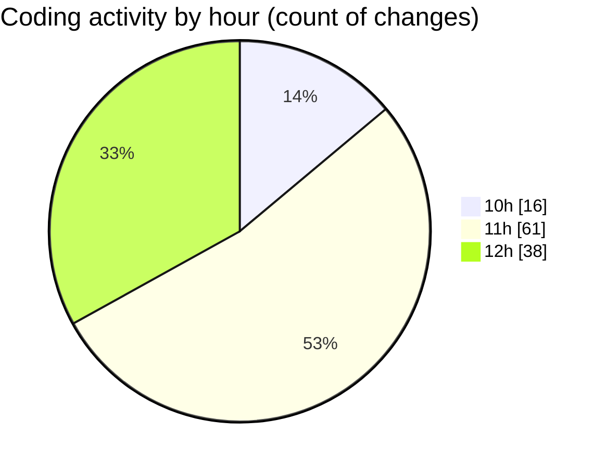

# cda - Activity Summary 

## Overall Statistics

| Stat                   | Value                                                             |
| ---------------------- | ----------------------------------------------------------------- |
| **Lines Added** (➕)   | 6772                                          |
| **Lines Removed** (➖) | 562                                        |
| **Net Change** (↕)    | 6210                |
| **Active Time** (⌚)   | 166 minutes |

## Modified Files
- **GroupMembersList.tsx** (+312, -219)
- **GroupMembersList.scss** (+36, -23)
- **SkillExplore.jsx** (+207, -0)
- **SkillAdmin.tsx** (+50, -0)
- **SkillTeam.tsx** (+135, -0)
- **SkillTeamUser.tsx** (+35, -0)
- **Groups.tsx** (+68, -8)
- **GroupDetails.tsx** (+355, -17)
- **GroupCreate.tsx** (+705, -25)
- **GroupCreate.test.tsx** (+384, -6)
- **Groups.test.tsx** (+98, -0)
- **skill-queries.ts** (+501, -105)
- **skills.js** (+140, -0)
- **skill-team-queries.ts** (+1051, -1)
- **queries.js** (+282, -22)
- **skills.js** (+402, -0)
- **skill-mutations.ts** (+789, -0)
- **mutations.js** (+707, -0)
- **GroupDetails.test.tsx** (+66, -2)
- **skill-group-mutations.ts** (+278, -0)
- **GroupDetails.scss** (+171, -134)

## Visualizations

### By File Type (Lines Changed)

### By Hour (Estimated Activity Count)

> **Last Updated:** 23/07/2026, 12:52:59