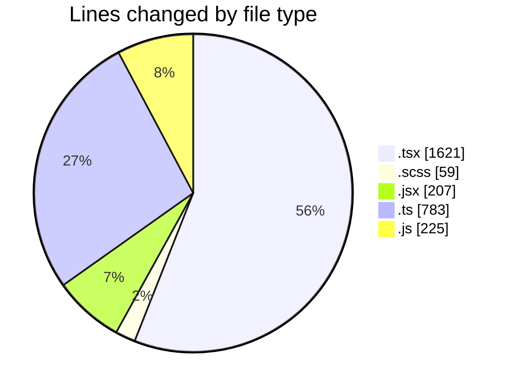
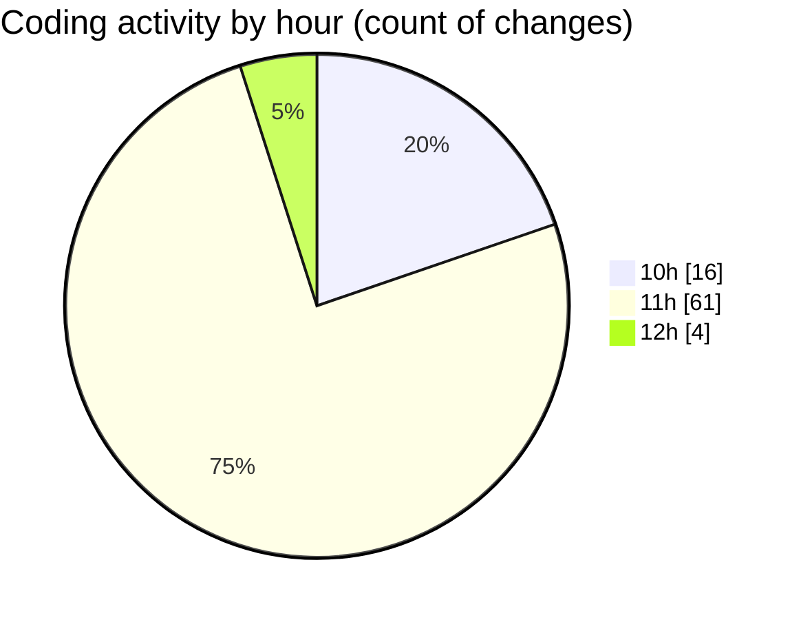

# cda - Activity Summary 

## Overall Statistics

| Stat                   | Value                                                             |
| ---------------------- | ----------------------------------------------------------------- |
| **Lines Added** (➕)   | 2593                                          |
| **Lines Removed** (➖) | 302                                        |
| **Net Change** (↕)    | 2291                |
| **Active Time** (⌚)   | 118 minutes |

## Modified Files
- **GroupMembersList.tsx** (+312, -219)
- **GroupMembersList.scss** (+36, -23)
- **SkillExplore.jsx** (+207, -0)
- **SkillAdmin.tsx** (+50, -0)
- **SkillTeam.tsx** (+135, -0)
- **SkillTeamUser.tsx** (+35, -0)
- **Groups.tsx** (+68, -8)
- **GroupDetails.tsx** (+180, -5)
- **GroupCreate.tsx** (+363, -20)
- **GroupCreate.test.tsx** (+171, -6)
- **Groups.test.tsx** (+49, -0)
- **skill-queries.ts** (+257, -16)
- **skills.js** (+69, -0)
- **skill-team-queries.ts** (+509, -1)
- **queries.js** (+152, -4)

## Visualizations

### By File Type (Lines Changed)

### By Hour (Estimated Activity Count)

> **Last Updated:** 23/07/2026, 12:02:24