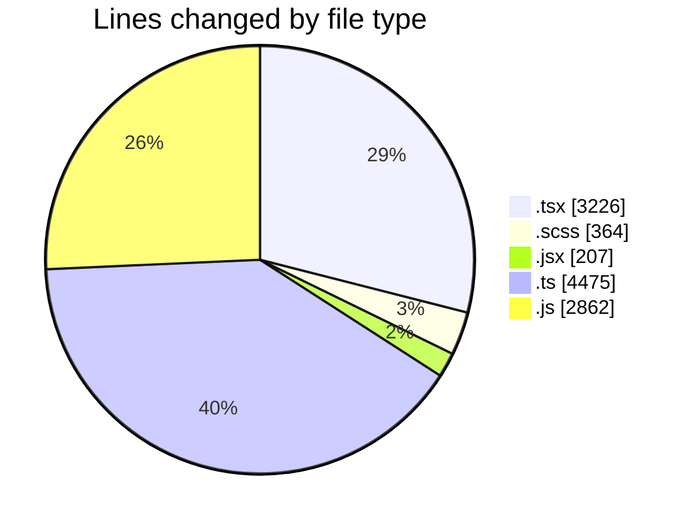
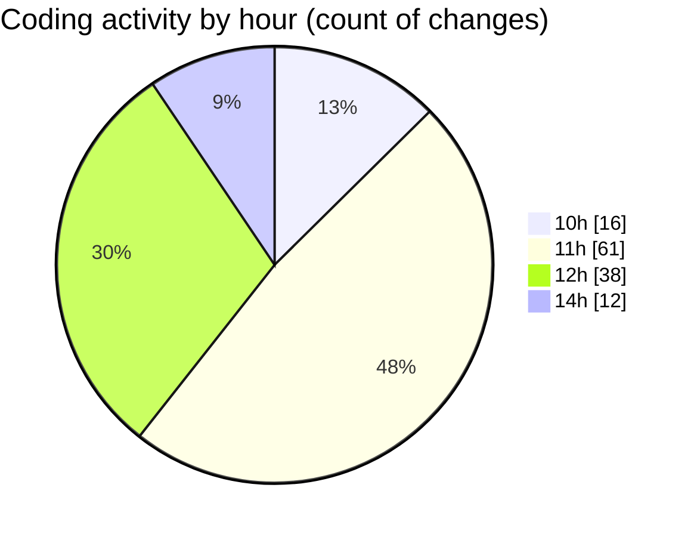

# cda - Activity Summary 

## Overall Statistics

| Stat                   | Value                                                             |
| ---------------------- | ----------------------------------------------------------------- |
| **Lines Added** (➕)   | 10572                                          |
| **Lines Removed** (➖) | 562                                        |
| **Net Change** (↕)    | 10010                |
| **Active Time** (⌚)   | 176 minutes |

## Modified Files
- **GroupMembersList.tsx** (+312, -219)
- **GroupMembersList.scss** (+36, -23)
- **SkillExplore.jsx** (+207, -0)
- **SkillAdmin.tsx** (+50, -0)
- **SkillTeam.tsx** (+135, -0)
- **SkillTeamUser.tsx** (+35, -0)
- **Groups.tsx** (+68, -8)
- **GroupDetails.tsx** (+518, -17)
- **GroupCreate.tsx** (+1045, -25)
- **GroupCreate.test.tsx** (+573, -6)
- **Groups.test.tsx** (+147, -0)
- **skill-queries.ts** (+659, -105)
- **skills.js** (+210, -0)
- **skill-team-queries.ts** (+1576, -1)
- **queries.js** (+412, -22)
- **skills.js** (+804, -0)
- **skill-mutations.ts** (+1578, -0)
- **mutations.js** (+1414, -0)
- **GroupDetails.test.tsx** (+66, -2)
- **skill-group-mutations.ts** (+556, -0)
- **GroupDetails.scss** (+171, -134)

## Visualizations

### By File Type (Lines Changed)

### By Hour (Estimated Activity Count)

> **Last Updated:** 23/07/2026, 14:44:10