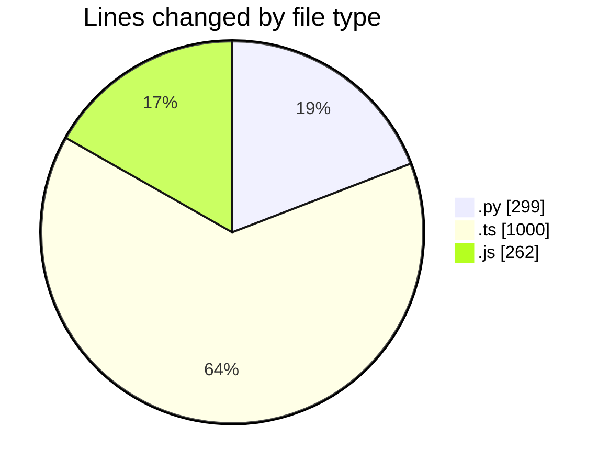
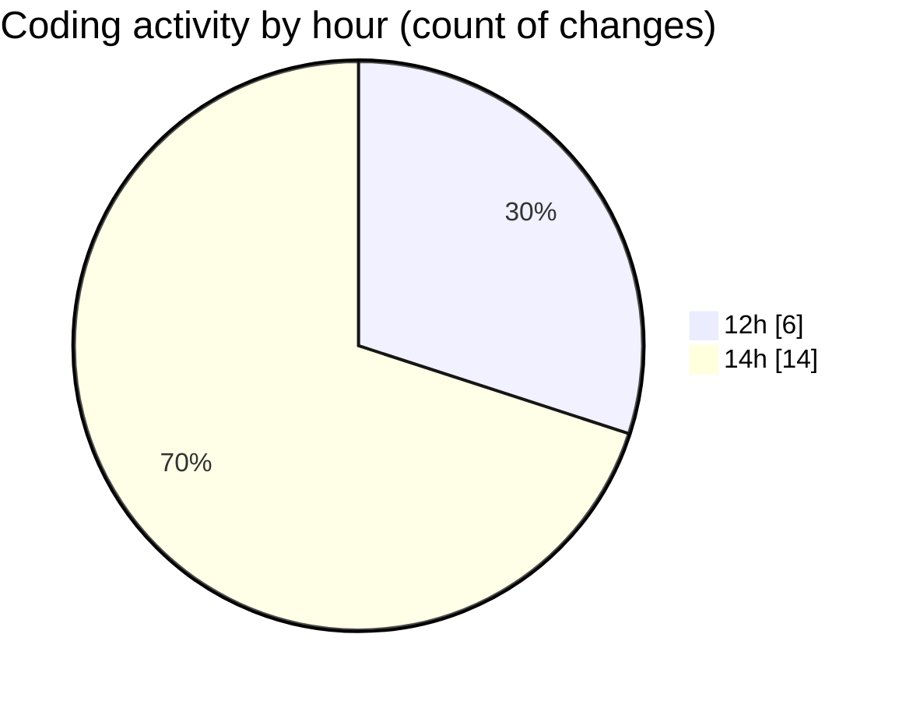

# cda - Activity Summary 

## Overall Statistics

| Stat                   | Value                                                             |
| ---------------------- | ----------------------------------------------------------------- |
| **Lines Added** (➕)   | 902                                          |
| **Lines Removed** (➖) | 659                                        |
| **Net Change** (↕)    | 243                |
| **Active Time** (⌚)   | 14 minutes |

## Modified Files
- **main.py** (+271, -28)
- **skill-team-queries.ts** (+280, -280)
- **skill-queries.ts** (+99, -99)
- **skills.js** (+22, -22)
- **queries.js** (+30, -30)
- **skill-mutations.ts** (+10, -10)
- **mutations.js** (+79, -79)
- **skill-group-mutations.ts** (+111, -111)

## Visualizations

### By File Type (Lines Changed)

### By Hour (Estimated Activity Count)

> **Last Updated:** 24/07/2026, 14:19:10