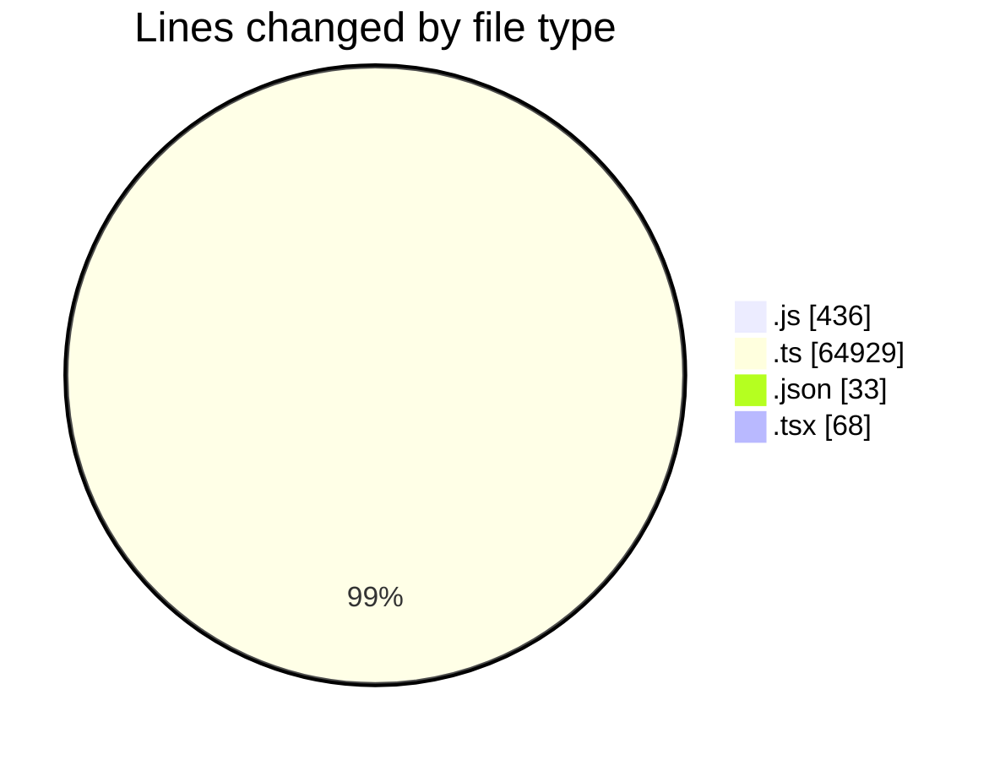
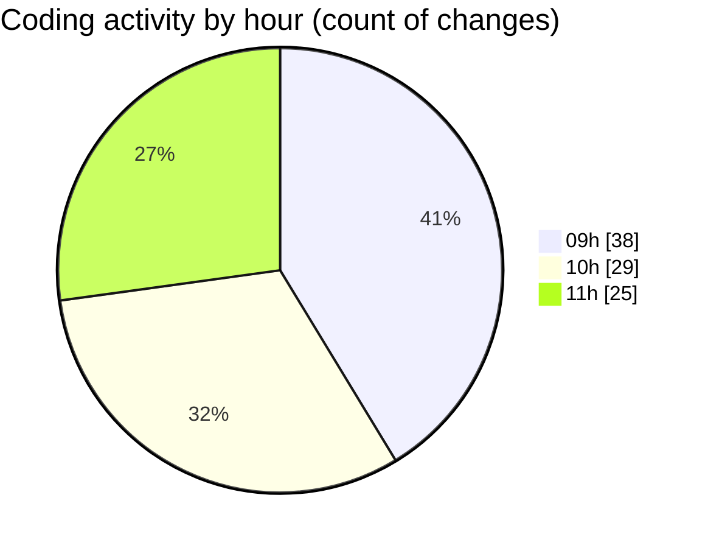

# cda - Activity Summary 

## Overall Statistics

| Stat                   | Value                                                             |
| ---------------------- | ----------------------------------------------------------------- |
| **Lines Added** (➕)   | 64401                                          |
| **Lines Removed** (➖) | 1065                                        |
| **Net Change** (↕)    | 63336                |
| **Active Time** (⌚)   | 129 minutes |

## Modified Files
- **skills.js** (+436, -0)
- **resolvers-types.ts** (+34145, -1)
- **resolvers-types.ts** (+24232, -0)
- **skill-queries.ts** (+678, -16)
- **skill-mutations.ts** (+1255, -113)
- **skills.ts** (+310, -0)
- **SkillGroups.ts** (+214, -0)
- **SkillGroups.test.ts** (+642, -0)
- **skill-group-queries.ts** (+755, -369)
- **skill-group-mutations.ts** (+1483, -558)
- **settings.json** (+33, -0)
- **global.d.ts** (+14, -6)
- **skill-job-family-mutations.ts** (+136, -2)
- **DescriptionListItem.tsx** (+68, -0)

## Visualizations

### By File Type (Lines Changed)

### By Hour (Estimated Activity Count)

> **Last Updated:** 27/07/2026, 11:57:26