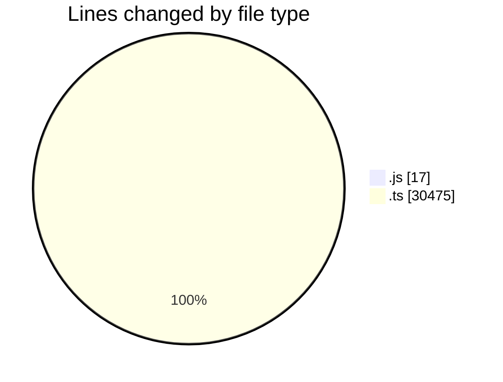
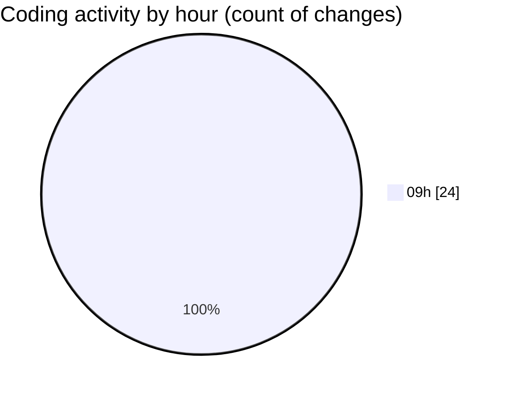

# cda - Activity Summary 

## Overall Statistics

| Stat                   | Value                                                             |
| ---------------------- | ----------------------------------------------------------------- |
| **Lines Added** (➕)   | 30365                                          |
| **Lines Removed** (➖) | 127                                        |
| **Net Change** (↕)    | 30238                |
| **Active Time** (⌚)   | 29 minutes |

## Modified Files
- **skills.js** (+17, -0)
- **resolvers-types.ts** (+17073, -1)
- **resolvers-types.ts** (+12116, -0)
- **skill-queries.ts** (+346, -14)
- **skill-mutations.ts** (+289, -112)
- **skills.ts** (+310, -0)
- **SkillGroups.ts** (+214, -0)

## Visualizations

### By File Type (Lines Changed)

### By Hour (Estimated Activity Count)

> **Last Updated:** 27/07/2026, 09:43:58