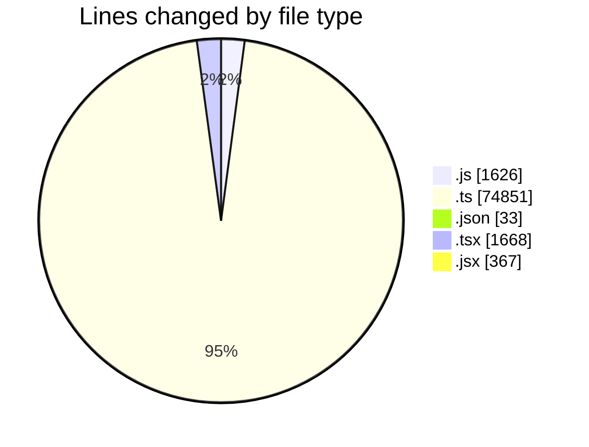
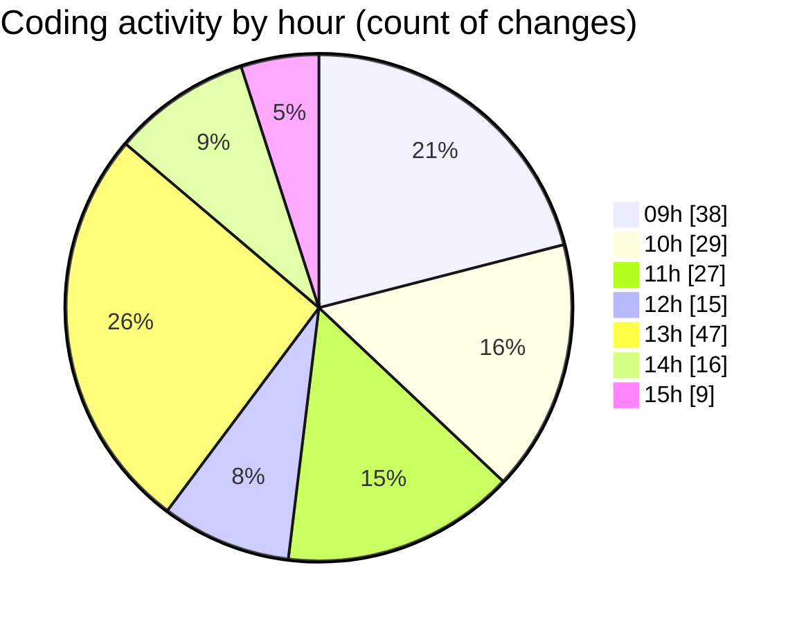

# cda - Activity Summary 

## Overall Statistics

| Stat                   | Value                                                             |
| ---------------------- | ----------------------------------------------------------------- |
| **Lines Added** (➕)   | 77362                                          |
| **Lines Removed** (➖) | 1183                                        |
| **Net Change** (↕)    | 76179                |
| **Active Time** (⌚)   | 236 minutes |

## Modified Files
- **skills.js** (+436, -0)
- **resolvers-types.ts** (+34145, -1)
- **resolvers-types.ts** (+24232, -0)
- **skill-queries.ts** (+681, -20)
- **skill-mutations.ts** (+1297, -132)
- **skills.ts** (+310, -0)
- **SkillGroups.ts** (+459, -0)
- **SkillGroups.test.ts** (+642, -0)
- **skill-group-queries.ts** (+868, -369)
- **skill-group-mutations.ts** (+1841, -558)
- **settings.json** (+33, -0)
- **global.d.ts** (+14, -6)
- **skill-job-family-mutations.ts** (+136, -2)
- **DescriptionListItem.tsx** (+68, -0)
- **skill-label-mutations.ts** (+132, -0)
- **queries.js** (+383, -6)
- **mutations.js** (+737, -0)
- **graphql.ts** (+8948, -0)
- **GroupDetails.tsx** (+163, -26)
- **SkillAddButton.jsx** (+38, -0)
- **TagOverview.jsx** (+41, -0)
- **SkillExplore.jsx** (+284, -4)
- **GroupDetails.test.tsx** (+102, -0)
- **SkillAddButton.test.js** (+60, -4)
- **SkillAddButton.test.ts** (+58, -0)
- **SkillAddButton.tsx** (+54, -7)
- **SkillAddButton.test.tsx** (+58, -2)
- **GroupMembersList.tsx** (+250, -23)
- **TagUserSkillOverview.tsx** (+76, -0)
- **GroupMembersList.test.tsx** (+154, -0)
- **TagOverview.tsx** (+70, -13)
- **SkillExplore.tsx** (+307, -10)
- **SkillExplore.test.tsx** (+285, -0)

## Visualizations

### By File Type (Lines Changed)

### By Hour (Estimated Activity Count)

> **Last Updated:** 27/07/2026, 15:12:26