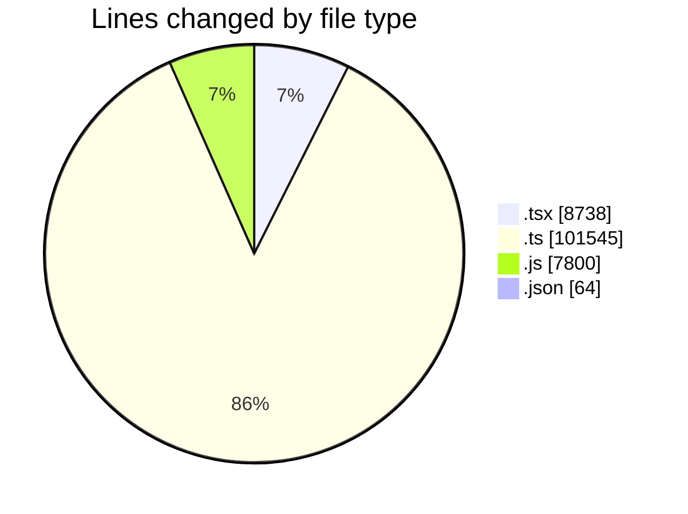
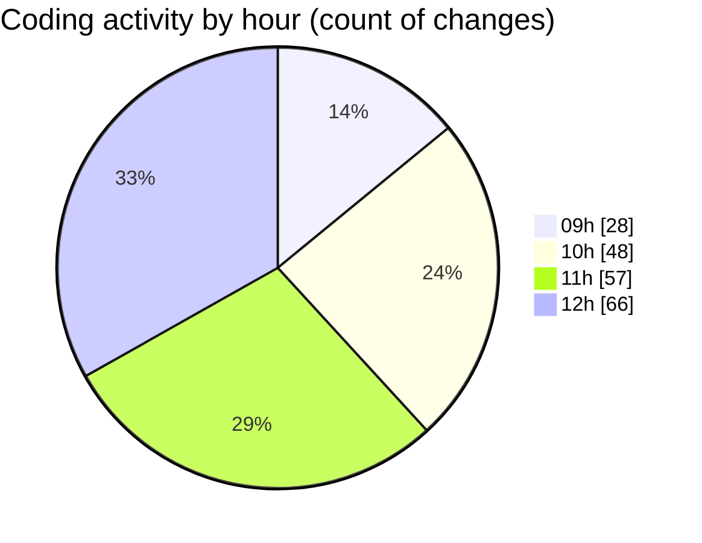

# cda - Activity Summary 

## Overall Statistics

| Stat                   | Value                                                             |
| ---------------------- | ----------------------------------------------------------------- |
| **Lines Added** (➕)   | 117948                                          |
| **Lines Removed** (➖) | 199                                        |
| **Net Change** (↕)    | 117749                |
| **Active Time** (⌚)   | 238 minutes |

## Modified Files
- **GroupCreate.tsx** (+1360, -0)
- **GroupCreate.test.tsx** (+756, -0)
- **Groups.test.tsx** (+196, -0)
- **skill-queries.ts** (+632, -0)
- **skills.js** (+280, -0)
- **skill-team-queries.ts** (+2100, -0)
- **queries.js** (+520, -0)
- **GroupDetails.tsx** (+636, -52)
- **skills.js** (+2099, -0)
- **skill-mutations.ts** (+3952, -0)
- **mutations.js** (+2948, -0)
- **skill-group-mutations.ts** (+3984, -0)
- **skill-queries.ts** (+1978, -34)
- **skills.ts** (+1833, -13)
- **SkillGroups.ts** (+1285, -0)
- **SkillGroups.test.ts** (+2667, -0)
- **skill-group-queries.ts** (+1080, -0)
- **queries.js** (+1889, -0)
- **GroupDetails.test.tsx** (+447, -11)
- **SkillAddButton.tsx** (+188, -0)
- **TagUserSkillOverview.tsx** (+304, -0)
- **GroupMembersList.tsx** (+891, -62)
- **GroupMembersList.test.tsx** (+861, -0)
- **SkillExplore.tsx** (+1178, -11)
- **TagOverview.tsx** (+228, -0)
- **SkillExplore.test.tsx** (+1130, -14)
- **TagOverview.test.tsx** (+168, -0)
- **package.json** (+64, -0)
- **graphql.ts** (+17896, -0)
- **gql.ts** (+286, -0)
- **graphql.ts** (+7324, -0)
- **resolvers-types.ts** (+34144, -0)
- **resolvers-types.ts** (+12118, -0)
- **views.ts** (+10219, -0)
- **App.tsx** (+245, -0)
- **20260724142439-create-profile-skill-group-to-skill-tag-table.js** (+62, -2)

## Visualizations

### By File Type (Lines Changed)

### By Hour (Estimated Activity Count)

> **Last Updated:** 30/07/2026, 12:55:46