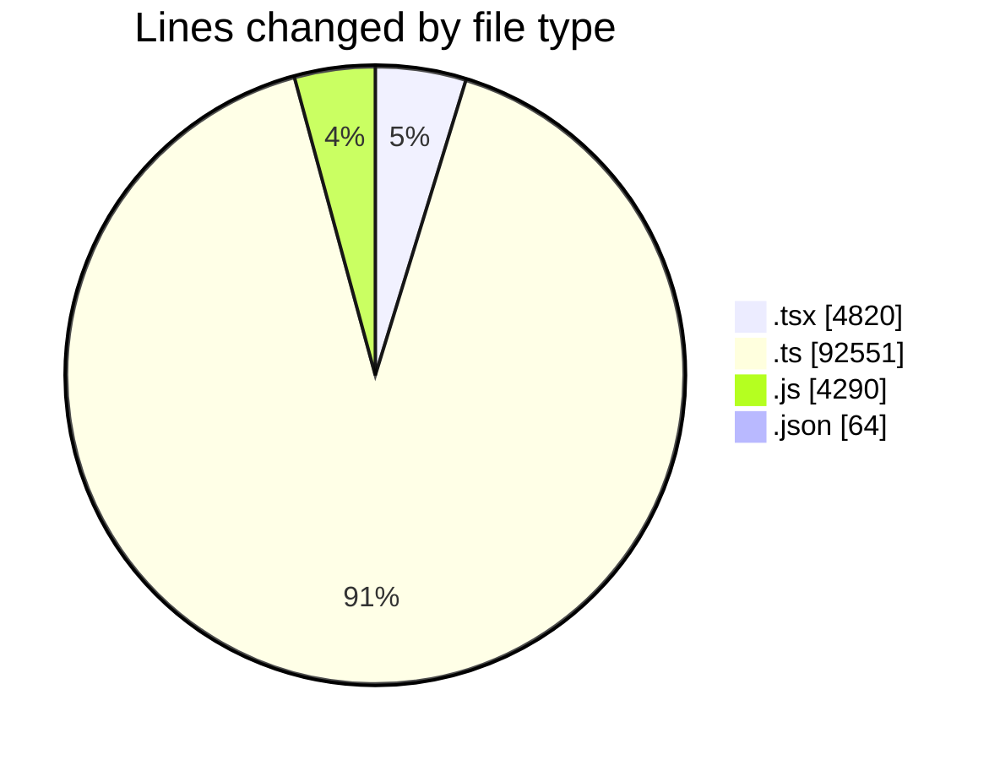
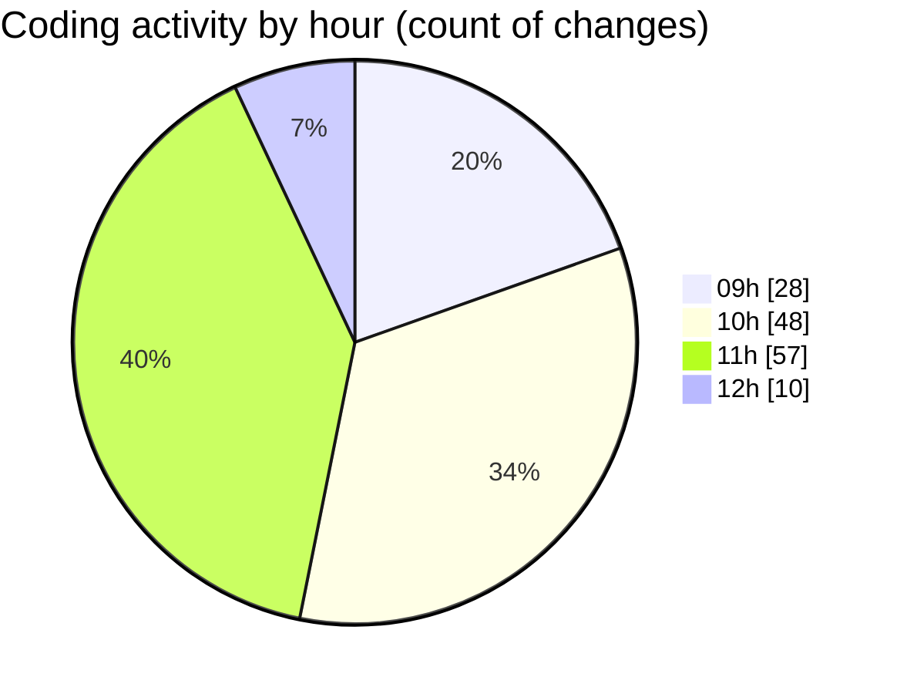

# cda - Activity Summary 

## Overall Statistics

| Stat                   | Value                                                             |
| ---------------------- | ----------------------------------------------------------------- |
| **Lines Added** (➕)   | 101526                                          |
| **Lines Removed** (➖) | 199                                        |
| **Net Change** (↕)    | 101327                |
| **Active Time** (⌚)   | 189 minutes |

## Modified Files
- **GroupCreate.tsx** (+680, -0)
- **GroupCreate.test.tsx** (+378, -0)
- **Groups.test.tsx** (+98, -0)
- **skill-queries.ts** (+316, -0)
- **skills.js** (+140, -0)
- **skill-team-queries.ts** (+1050, -0)
- **queries.js** (+260, -0)
- **GroupDetails.tsx** (+344, -52)
- **skills.js** (+1259, -0)
- **skill-mutations.ts** (+1976, -0)
- **mutations.js** (+1474, -0)
- **skill-group-mutations.ts** (+1992, -0)
- **skill-queries.ts** (+1332, -34)
- **skills.ts** (+1229, -13)
- **SkillGroups.ts** (+765, -0)
- **SkillGroups.test.ts** (+1317, -0)
- **skill-group-queries.ts** (+540, -0)
- **queries.js** (+1133, -0)
- **GroupDetails.test.tsx** (+229, -11)
- **SkillAddButton.tsx** (+94, -0)
- **TagUserSkillOverview.tsx** (+152, -0)
- **GroupMembersList.tsx** (+561, -62)
- **GroupMembersList.test.tsx** (+515, -0)
- **SkillExplore.tsx** (+600, -11)
- **TagOverview.tsx** (+114, -0)
- **SkillExplore.test.tsx** (+576, -14)
- **TagOverview.test.tsx** (+84, -0)
- **package.json** (+64, -0)
- **graphql.ts** (+17896, -0)
- **gql.ts** (+286, -0)
- **graphql.ts** (+7324, -0)
- **resolvers-types.ts** (+34144, -0)
- **resolvers-types.ts** (+12118, -0)
- **views.ts** (+10219, -0)
- **App.tsx** (+245, -0)
- **20260724142439-create-profile-skill-group-to-skill-tag-table.js** (+22, -2)

## Visualizations

### By File Type (Lines Changed)

### By Hour (Estimated Activity Count)

> **Last Updated:** 30/07/2026, 12:20:53