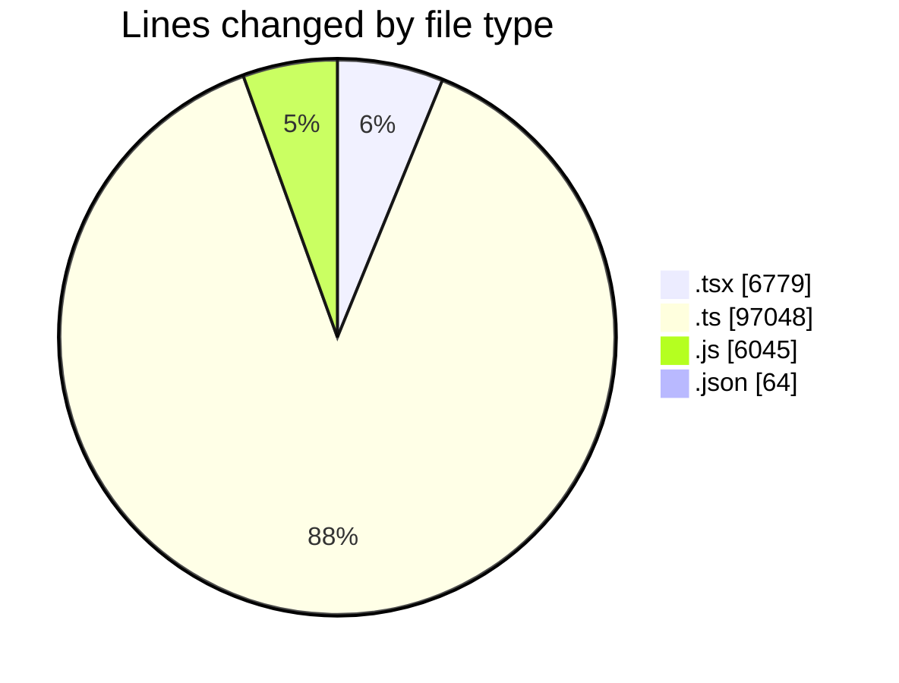
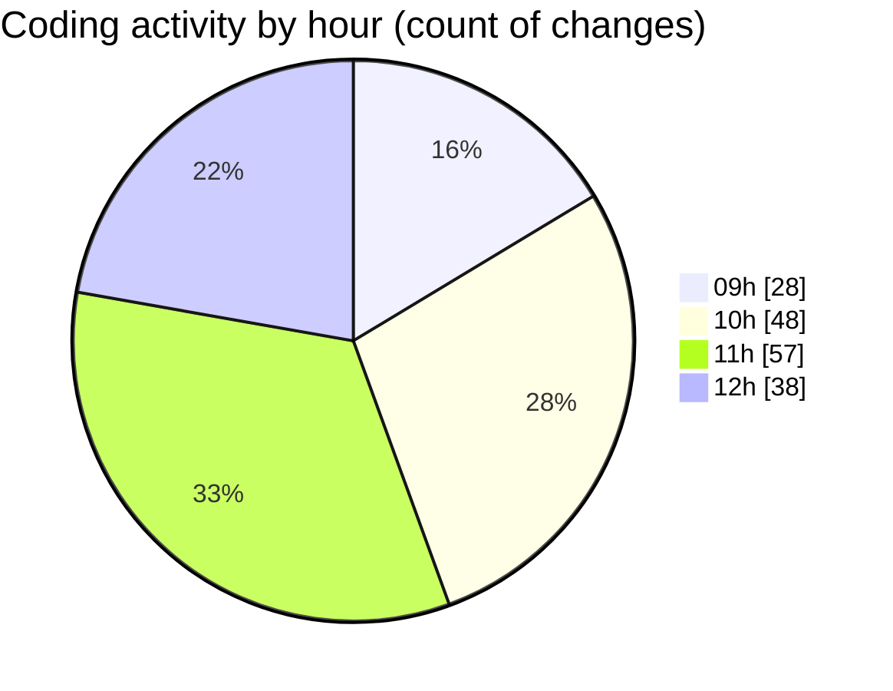

# cda - Activity Summary 

## Overall Statistics

| Stat                   | Value                                                             |
| ---------------------- | ----------------------------------------------------------------- |
| **Lines Added** (➕)   | 109737                                          |
| **Lines Removed** (➖) | 199                                        |
| **Net Change** (↕)    | 109538                |
| **Active Time** (⌚)   | 216 minutes |

## Modified Files
- **GroupCreate.tsx** (+1020, -0)
- **GroupCreate.test.tsx** (+567, -0)
- **Groups.test.tsx** (+147, -0)
- **skill-queries.ts** (+474, -0)
- **skills.js** (+210, -0)
- **skill-team-queries.ts** (+1575, -0)
- **queries.js** (+390, -0)
- **GroupDetails.tsx** (+490, -52)
- **skills.js** (+1679, -0)
- **skill-mutations.ts** (+2964, -0)
- **mutations.js** (+2211, -0)
- **skill-group-mutations.ts** (+2988, -0)
- **skill-queries.ts** (+1655, -34)
- **skills.ts** (+1531, -13)
- **SkillGroups.ts** (+1025, -0)
- **SkillGroups.test.ts** (+1992, -0)
- **skill-group-queries.ts** (+810, -0)
- **queries.js** (+1511, -0)
- **GroupDetails.test.tsx** (+338, -11)
- **SkillAddButton.tsx** (+141, -0)
- **TagUserSkillOverview.tsx** (+228, -0)
- **GroupMembersList.tsx** (+726, -62)
- **GroupMembersList.test.tsx** (+688, -0)
- **SkillExplore.tsx** (+889, -11)
- **TagOverview.tsx** (+171, -0)
- **SkillExplore.test.tsx** (+853, -14)
- **TagOverview.test.tsx** (+126, -0)
- **package.json** (+64, -0)
- **graphql.ts** (+17896, -0)
- **gql.ts** (+286, -0)
- **graphql.ts** (+7324, -0)
- **resolvers-types.ts** (+34144, -0)
- **resolvers-types.ts** (+12118, -0)
- **views.ts** (+10219, -0)
- **App.tsx** (+245, -0)
- **20260724142439-create-profile-skill-group-to-skill-tag-table.js** (+42, -2)

## Visualizations

### By File Type (Lines Changed)

### By Hour (Estimated Activity Count)

> **Last Updated:** 30/07/2026, 12:48:22