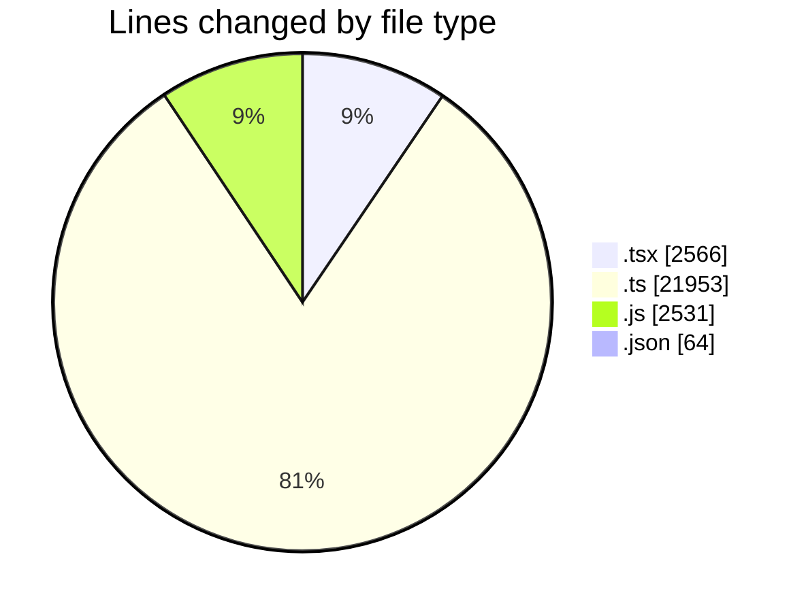
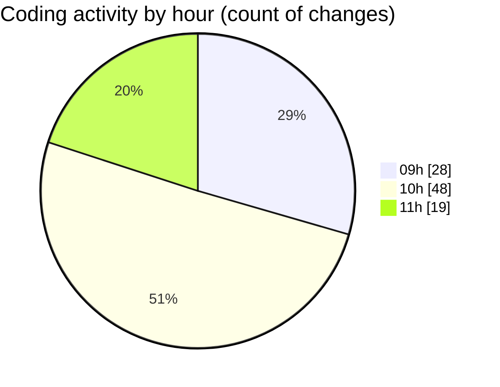

# cda - Activity Summary 

## Overall Statistics

| Stat                   | Value                                                             |
| ---------------------- | ----------------------------------------------------------------- |
| **Lines Added** (➕)   | 26972                                          |
| **Lines Removed** (➖) | 142                                        |
| **Net Change** (↕)    | 26830                |
| **Active Time** (⌚)   | 126 minutes |

## Modified Files
- **GroupCreate.tsx** (+340, -0)
- **GroupCreate.test.tsx** (+189, -0)
- **Groups.test.tsx** (+49, -0)
- **skill-queries.ts** (+158, -0)
- **skills.js** (+70, -0)
- **skill-team-queries.ts** (+525, -0)
- **queries.js** (+130, -0)
- **GroupDetails.tsx** (+198, -52)
- **skills.js** (+839, -0)
- **skill-mutations.ts** (+988, -0)
- **mutations.js** (+737, -0)
- **skill-group-mutations.ts** (+996, -0)
- **skill-queries.ts** (+669, -17)
- **skills.ts** (+625, -0)
- **SkillGroups.ts** (+505, -0)
- **SkillGroups.test.ts** (+642, -0)
- **skill-group-queries.ts** (+270, -0)
- **queries.js** (+755, -0)
- **GroupDetails.test.tsx** (+120, -11)
- **SkillAddButton.tsx** (+47, -0)
- **TagUserSkillOverview.tsx** (+76, -0)
- **GroupMembersList.tsx** (+396, -62)
- **GroupMembersList.test.tsx** (+342, -0)
- **SkillExplore.tsx** (+300, -0)
- **TagOverview.tsx** (+57, -0)
- **SkillExplore.test.tsx** (+285, -0)
- **TagOverview.test.tsx** (+42, -0)
- **package.json** (+64, -0)
- **graphql.ts** (+8948, -0)
- **gql.ts** (+286, -0)
- **graphql.ts** (+7324, -0)

## Visualizations

### By File Type (Lines Changed)

### By Hour (Estimated Activity Count)

> **Last Updated:** 30/07/2026, 11:28:38