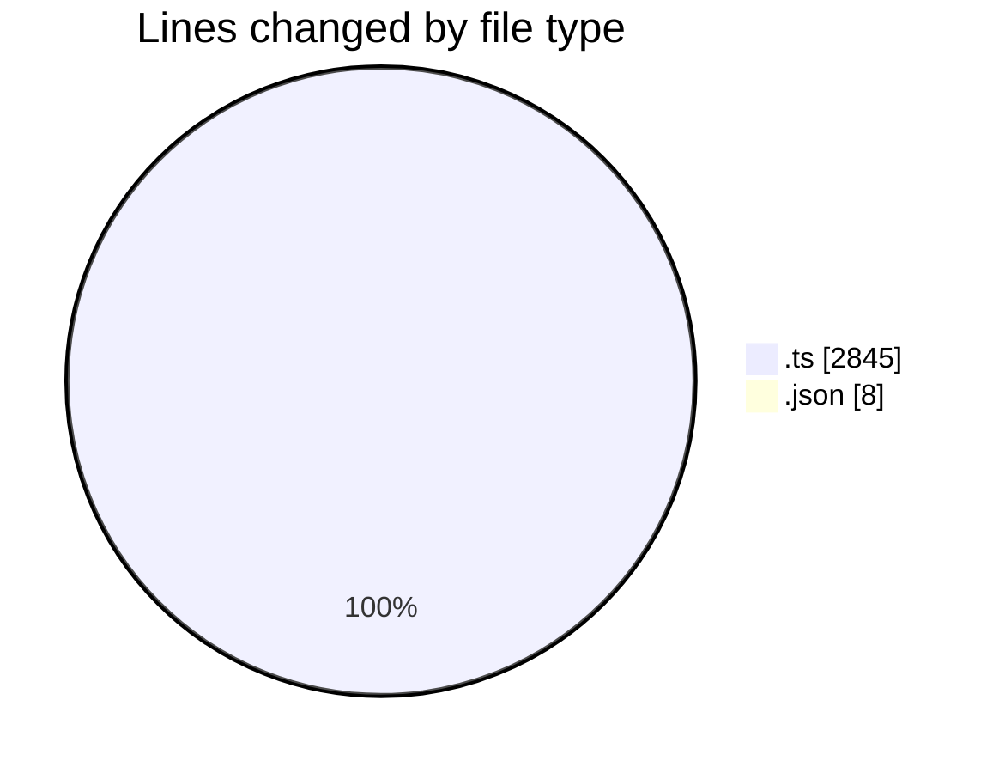
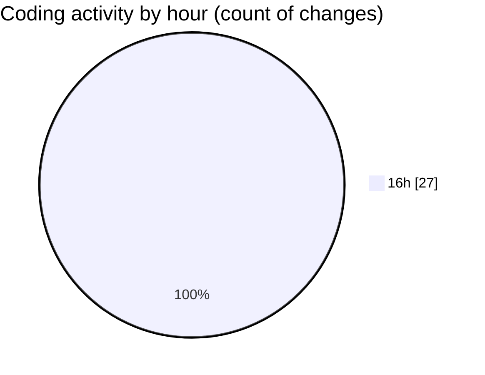

# broadcaster-playout-dashboard - Activity Summary 

## Overall Statistics

| Stat                   | Value                                                             |
| ---------------------- | ----------------------------------------------------------------- |
| **Lines Added** (➕)   | 2490                                          |
| **Lines Removed** (➖) | 363                                        |
| **Net Change** (↕)    | 2127                |
| **Active Time** (⌚)   | 27 minutes |

## Modified Files
- **environment.ts** (+60, -12)
- **stream.ts** (+27, -0)
- **exec.ts** (+52, -2)
- **path.ts** (+18, -2)
- **time.ts** (+42, -0)
- **server.ts** (+2163, -338)
- **settings.json** (+8, -0)
- **server-utils.test.ts** (+32, -0)
- **server-api.test.ts** (+88, -9)

## Visualizations

### By File Type (Lines Changed)

### By Hour (Estimated Activity Count)

> **Last Updated:** 31/07/2026, 16:21:27