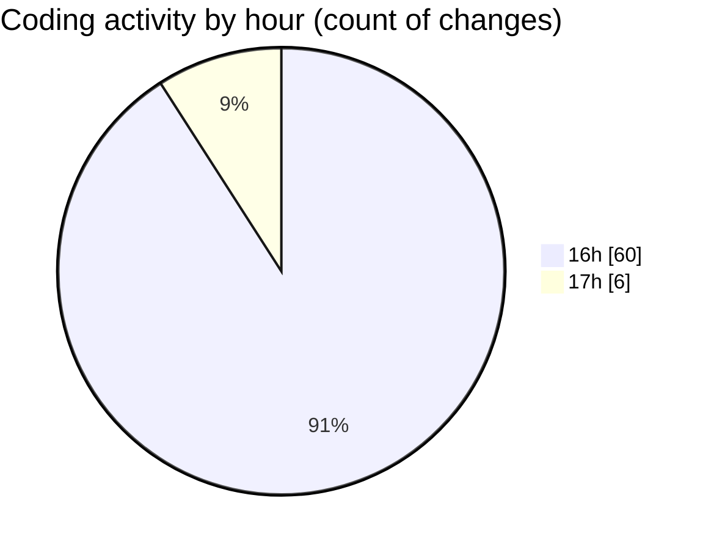

# broadcaster-playout-dashboard - Activity Summary 

## Overall Statistics

| Stat                   | Value                                                             |
| ---------------------- | ----------------------------------------------------------------- |
| **Lines Added** (➕)   | 5256                                          |
| **Lines Removed** (➖) | 2778                                        |
| **Net Change** (↕)    | 2478                |
| **Active Time** (⌚)   | 78 minutes |

## Modified Files
- **environment.ts** (+60, -12)
- **stream.ts** (+27, -0)
- **exec.ts** (+52, -2)
- **path.ts** (+18, -2)
- **time.ts** (+42, -0)
- **server.ts** (+2163, -1959)
- **settings.json** (+8, -0)
- **server-utils.test.ts** (+32, -0)
- **server-api.test.ts** (+102, -9)
- **mediaLibrary.service.ts** (+111, -0)
- **playlistFile.service.ts** (+60, -0)
- **processInspection.service.ts** (+174, -0)
- **streamControl.service.ts** (+238, -0)
- **monitoringMetrics.service.ts** (+508, -5)
- **apiRoutes.ts** (+721, -704)
- **routeTypes.ts** (+13, -0)
- **mediaRoutes.ts** (+82, -0)
- **playlistRoutes.ts** (+296, -3)
- **monitoringRoutes.ts** (+337, -82)
- **monitoringRouteHelpers.ts** (+95, -0)
- **monitoring-route-helpers.test.ts** (+117, -0)

## Visualizations

### By File Type (Lines Changed)

### By Hour (Estimated Activity Count)

> **Last Updated:** 31/07/2026, 17:21:27