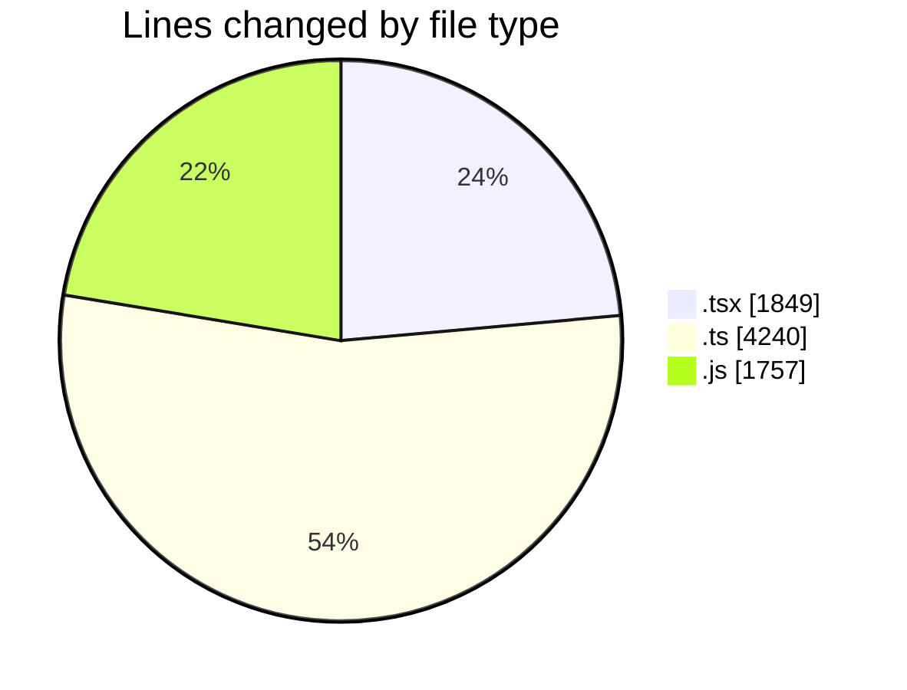
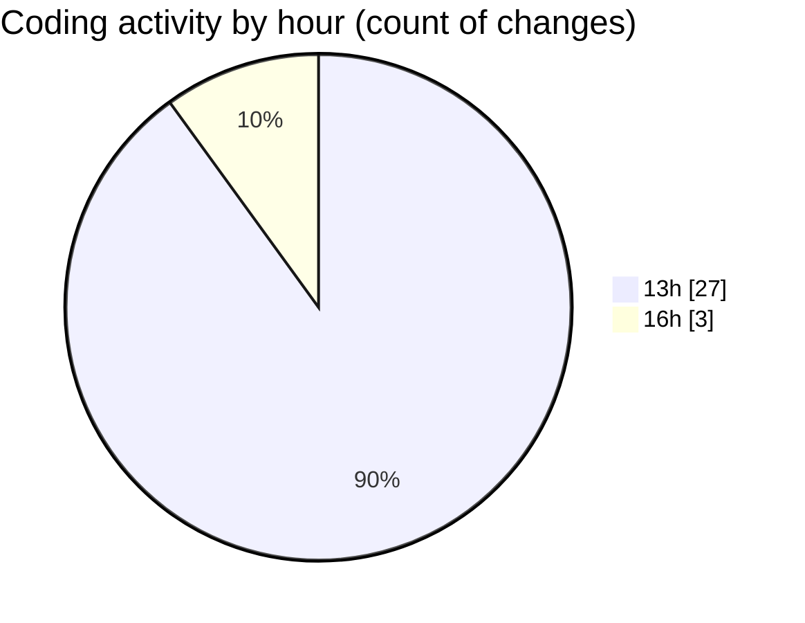

# cda - Activity Summary 

## Overall Statistics

| Stat                   | Value                                                             |
| ---------------------- | ----------------------------------------------------------------- |
| **Lines Added** (➕)   | 7846                                          |
| **Lines Removed** (➖) | 0                                        |
| **Net Change** (↕)    | 7846                |
| **Active Time** (⌚)   | 29 minutes |

## Modified Files
- **GroupCreate.tsx** (+340, -0)
- **GroupCreate.test.tsx** (+189, -0)
- **Groups.test.tsx** (+49, -0)
- **skill-queries.ts** (+158, -0)
- **skills.js** (+70, -0)
- **skill-team-queries.ts** (+525, -0)
- **queries.js** (+130, -0)
- **GroupDetails.tsx** (+145, -0)
- **skills.js** (+416, -0)
- **skill-mutations.ts** (+946, -0)
- **mutations.js** (+737, -0)
- **skill-group-mutations.ts** (+996, -0)
- **skills.ts** (+282, -0)
- **SkillGroups.ts** (+260, -0)
- **SkillGroups.test.ts** (+675, -0)
- **skill-group-queries.ts** (+250, -0)
- **queries.js** (+368, -0)
- **SkillAddButton.tsx** (+47, -0)
- **GroupMembersList.tsx** (+165, -0)
- **TagUserSkillOverview.tsx** (+76, -0)
- **GroupMembersList.test.tsx** (+173, -0)
- **TagOverview.tsx** (+57, -0)
- **SkillExplore.tsx** (+289, -0)
- **SkillExplore.test.tsx** (+277, -0)
- **TagOverview.test.tsx** (+42, -0)
- **20260724142439-create-profile-skill-group-to-skill-tag-table.js** (+20, -0)
- **20260724143808-profile-skill-group-skills-view.js** (+16, -0)
- **skill-queries.ts** (+148, -0)

## Visualizations

### By File Type (Lines Changed)

### By Hour (Estimated Activity Count)

> **Last Updated:** 31/07/2026, 16:22:09