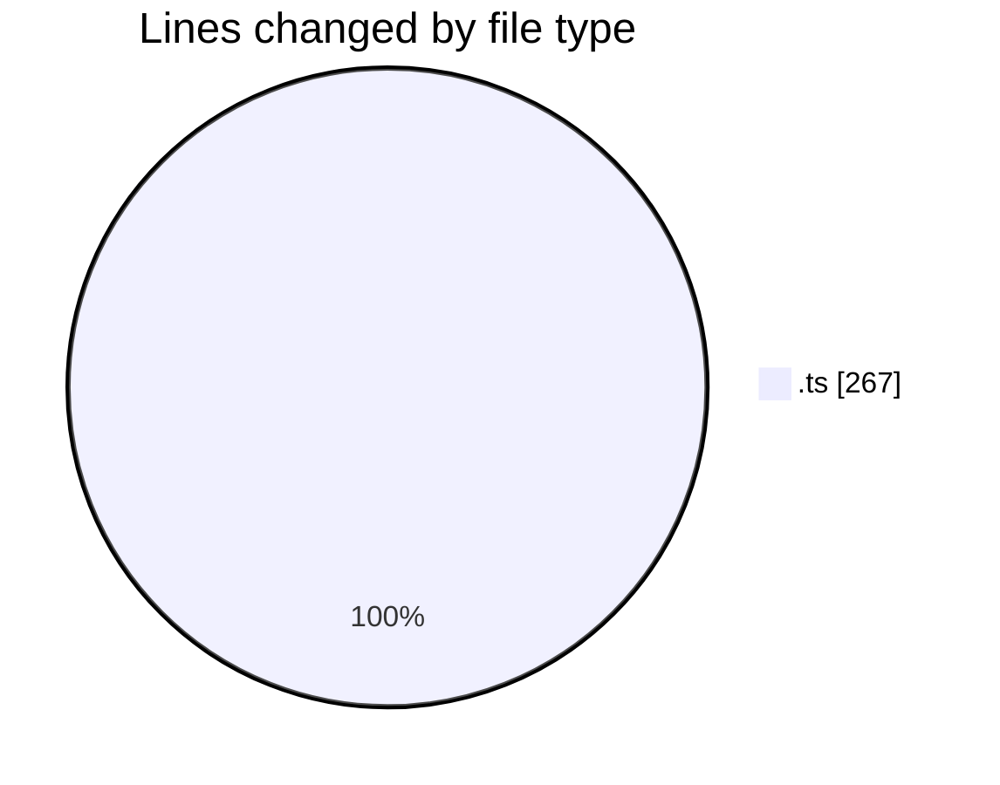
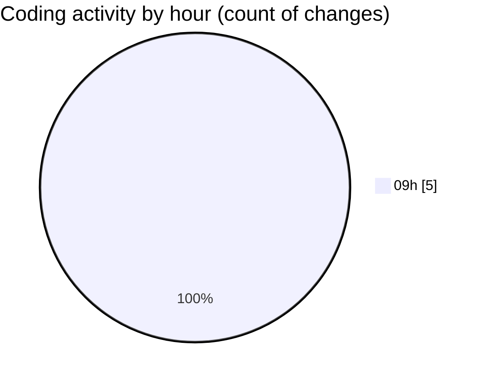

# broadcaster-playout-dashboard - Activity Summary 

## Overall Statistics

| Stat                   | Value                                                             |
| ---------------------- | ----------------------------------------------------------------- |
| **Lines Added** (➕)   | 218                                          |
| **Lines Removed** (➖) | 49                                        |
| **Net Change** (↕)    | 169                |
| **Active Time** (⌚)   | 4 minutes |

## Modified Files
- **monitoringRestartHelpers.ts** (+126, -0)
- **monitoring-restart-helpers.test.ts** (+92, -0)
- **monitoringRoutes.ts** (+0, -49)

## Visualizations

### By File Type (Lines Changed)

### By Hour (Estimated Activity Count)

> **Last Updated:** 03/08/2026, 09:31:28