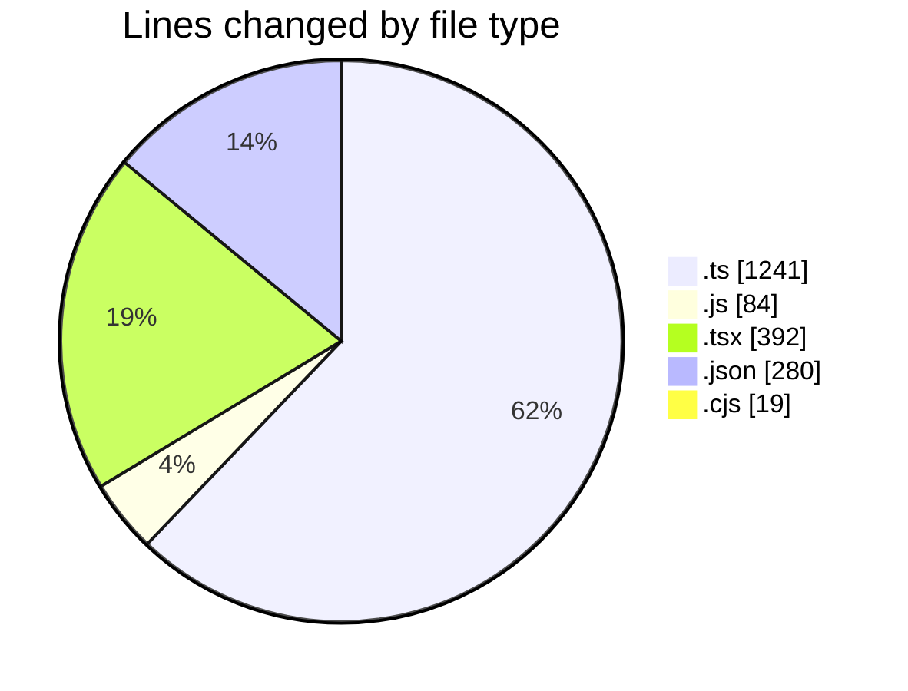
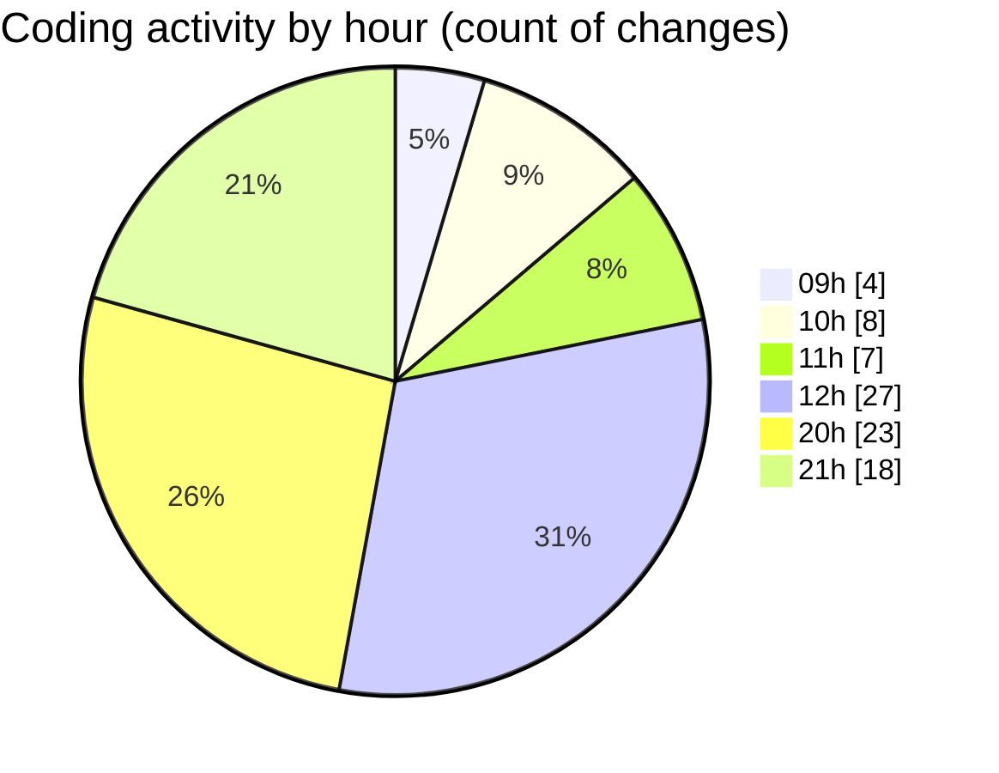

# cda - Activity Summary 

## Overall Statistics

| Stat                   | Value                                                             |
| ---------------------- | ----------------------------------------------------------------- |
| **Lines Added** (➕)   | 1498                                          |
| **Lines Removed** (➖) | 518                                        |
| **Net Change** (↕)    | 980                |
| **Active Time** (⌚)   | 103 minutes |

## Modified Files
- **S3Service.ts** (+95, -24)
- **IS3Service.ts** (+17, -1)
- **IS3Service.d.ts** (+9, -0)
- **S3Service.js** (+44, -0)
- **S3Service.d.ts** (+12, -0)
- **skill-queries.ts** (+288, -240)
- **skill-queries.ts** (+1, -0)
- **GroupDetails.tsx** (+53, -49)
- **lambda-policy.json** (+208, -28)
- **settings.json** (+44, -0)
- **IS3Service.d.ts** (+9, -0)
- **skill-export.test.ts** (+284, -4)
- **jest.config.cjs** (+18, -1)
- **skill-people-queries.ts** (+245, -3)
- **skill-group-queries.ts** (+6, -3)
- **App.tsx** (+25, -25)
- **queries.js** (+14, -14)
- **skills.js** (+6, -6)
- **GroupMembersList.tsx** (+96, -96)
- **SkillTopicUsers.tsx** (+24, -24)

## Visualizations

### By File Type (Lines Changed)

### By Hour (Estimated Activity Count)

> **Last Updated:** 03/08/2026, 21:17:11