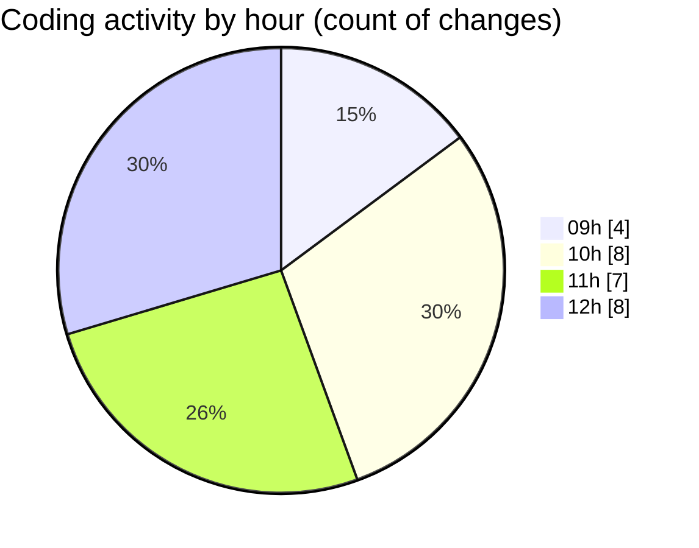

# cda - Activity Summary 

## Overall Statistics

| Stat                   | Value                                                             |
| ---------------------- | ----------------------------------------------------------------- |
| **Lines Added** (➕)   | 450                                          |
| **Lines Removed** (➖) | 65                                        |
| **Net Change** (↕)    | 385                |
| **Active Time** (⌚)   | 46 minutes |

## Modified Files
- **S3Service.ts** (+81, -10)
- **IS3Service.ts** (+17, -1)
- **IS3Service.d.ts** (+9, -0)
- **S3Service.js** (+44, -0)
- **S3Service.d.ts** (+12, -0)
- **skill-queries.ts** (+63, -15)
- **skill-queries.ts** (+1, -0)
- **GroupDetails.tsx** (+15, -11)
- **lambda-policy.json** (+208, -28)

## Visualizations

### By File Type (Lines Changed)

### By Hour (Estimated Activity Count)

> **Last Updated:** 03/08/2026, 12:17:11