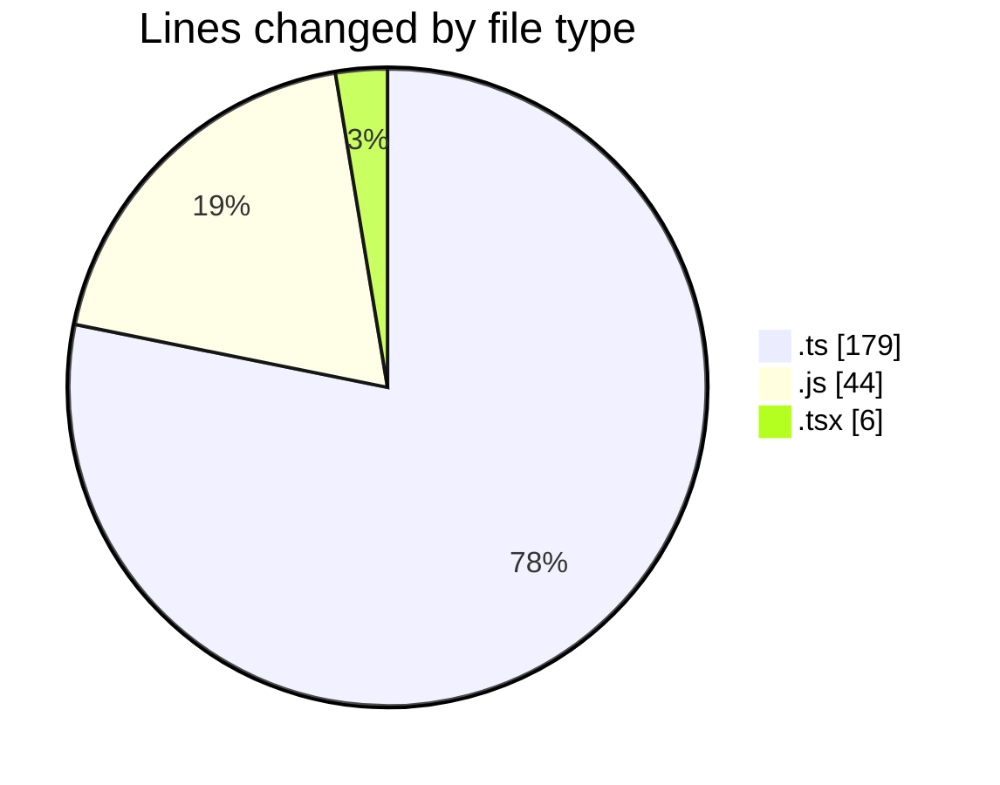
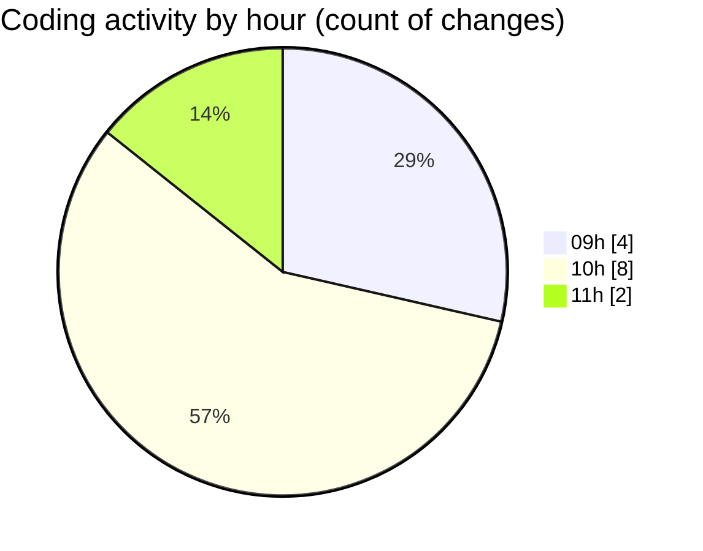

# cda - Activity Summary 

## Overall Statistics

| Stat                   | Value                                                             |
| ---------------------- | ----------------------------------------------------------------- |
| **Lines Added** (➕)   | 218                                          |
| **Lines Removed** (➖) | 11                                        |
| **Net Change** (↕)    | 207                |
| **Active Time** (⌚)   | 28 minutes |

## Modified Files
- **S3Service.ts** (+81, -10)
- **IS3Service.ts** (+17, -1)
- **IS3Service.d.ts** (+9, -0)
- **S3Service.js** (+44, -0)
- **S3Service.d.ts** (+12, -0)
- **skill-queries.ts** (+48, -0)
- **skill-queries.ts** (+1, -0)
- **GroupDetails.tsx** (+6, -0)

## Visualizations

### By File Type (Lines Changed)

### By Hour (Estimated Activity Count)

> **Last Updated:** 03/08/2026, 11:32:11