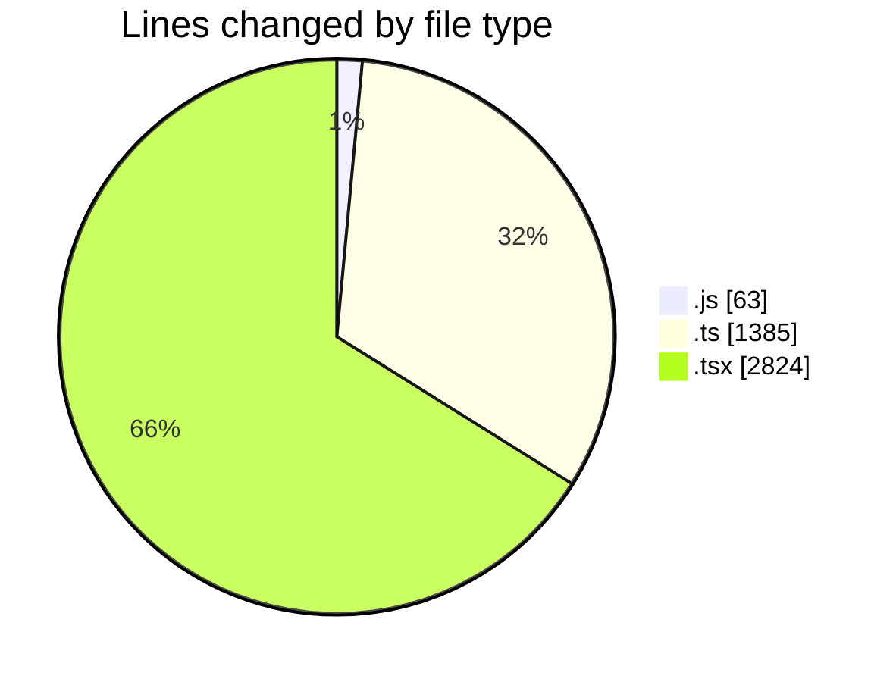
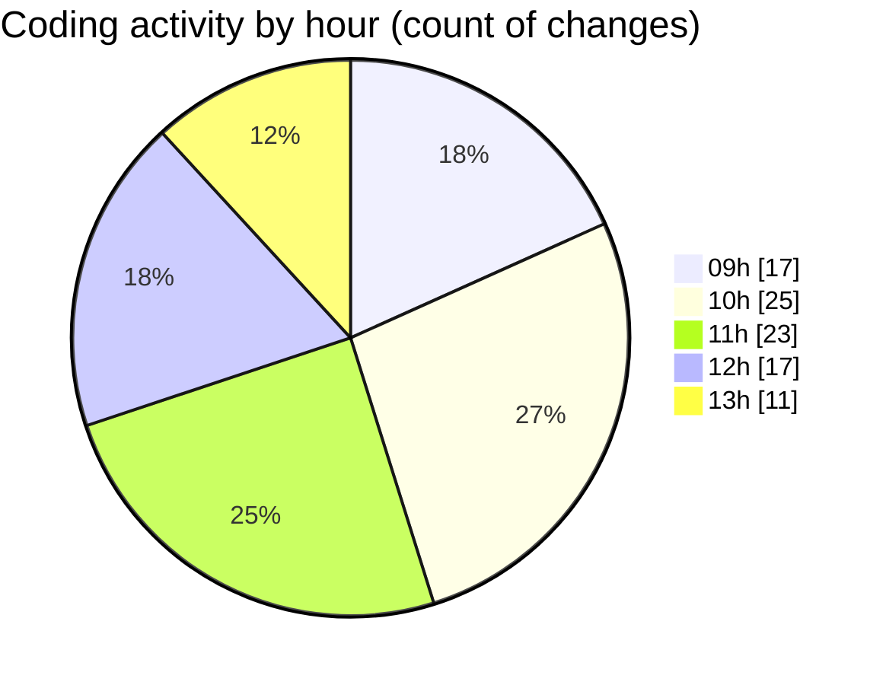

# cda - Activity Summary 

## Overall Statistics

| Stat                   | Value                                                             |
| ---------------------- | ----------------------------------------------------------------- |
| **Lines Added** (➕)   | 3391                                          |
| **Lines Removed** (➖) | 881                                        |
| **Net Change** (↕)    | 2510                |
| **Active Time** (⌚)   | 71 minutes |

## Modified Files
- **skills.js** (+8, -14)
- **queries.js** (+14, -27)
- **skill-queries.ts** (+22, -201)
- **GroupDetails.tsx** (+26, -52)
- **skill-people-queries.ts** (+0, -3)
- **skill-group-queries.ts** (+95, -98)
- **GroupMembersList.tsx** (+170, -263)
- **App.tsx** (+80, -10)
- **declarations.d.ts** (+445, -0)
- **DateSwitcher.test.tsx** (+268, -42)
- **getWeekInMonth.test.ts** (+108, -35)
- **dateOnly.ts** (+22, -0)
- **DateSwitcher.tsx** (+105, -7)
- **Sidebar.tsx** (+86, -1)
- **Home.tsx** (+475, -16)
- **getWeeksInMonth.ts** (+72, -1)
- **MonthlyViewRow.test.tsx** (+155, -1)
- **MonthlyViewRow.tsx** (+182, -2)
- **WeekView.tsx** (+115, -1)
- **WeekViewHeader.tsx** (+62, -4)
- **WeekTab.tsx** (+75, -1)
- **DutyWeekWrapper.tsx** (+68, -3)
- **DateView.tsx** (+218, -1)
- **AllocateDay.tsx** (+60, -1)
- **DayView.tsx** (+156, -1)
- **useDateViewSwipe.ts** (+221, -17)
- **getBorderStyle.ts** (+44, -1)
- **App.tsx** (+39, -78)

## Visualizations

### By File Type (Lines Changed)

### By Hour (Estimated Activity Count)

> **Last Updated:** 04/08/2026, 13:22:12