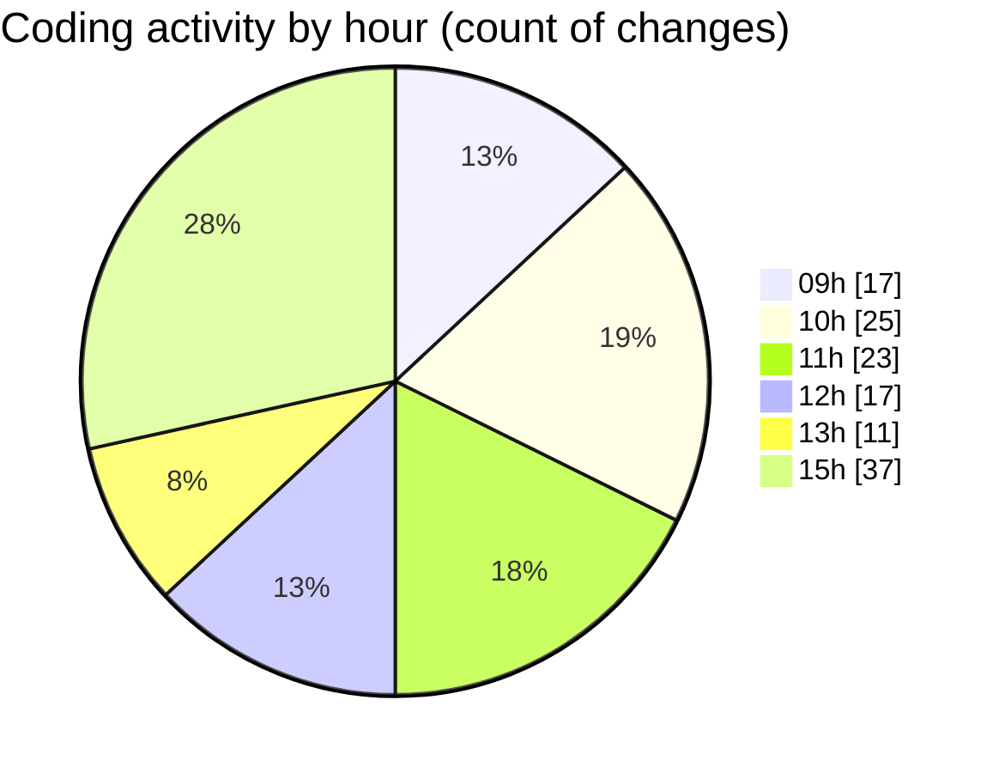

# cda - Activity Summary 

## Overall Statistics

| Stat                   | Value                                                             |
| ---------------------- | ----------------------------------------------------------------- |
| **Lines Added** (➕)   | 3627                                          |
| **Lines Removed** (➖) | 983                                        |
| **Net Change** (↕)    | 2644                |
| **Active Time** (⌚)   | 74 minutes |

## Modified Files
- **skills.js** (+8, -14)
- **queries.js** (+14, -27)
- **skill-queries.ts** (+22, -201)
- **GroupDetails.tsx** (+28, -52)
- **skill-people-queries.ts** (+0, -3)
- **skill-group-queries.ts** (+95, -98)
- **GroupMembersList.tsx** (+263, -263)
- **App.tsx** (+80, -10)
- **declarations.d.ts** (+445, -0)
- **DateSwitcher.test.tsx** (+299, -73)
- **getWeekInMonth.test.ts** (+122, -49)
- **dateOnly.ts** (+22, -0)
- **DateSwitcher.tsx** (+112, -14)
- **Sidebar.tsx** (+87, -2)
- **Home.tsx** (+491, -32)
- **getWeeksInMonth.ts** (+73, -2)
- **MonthlyViewRow.test.tsx** (+156, -2)
- **MonthlyViewRow.tsx** (+184, -4)
- **WeekView.tsx** (+116, -2)
- **WeekViewHeader.tsx** (+65, -7)
- **WeekTab.tsx** (+76, -2)
- **DutyWeekWrapper.tsx** (+71, -6)
- **DateView.tsx** (+219, -2)
- **AllocateDay.tsx** (+61, -2)
- **DayView.tsx** (+157, -2)
- **useDateViewSwipe.ts** (+238, -34)
- **getBorderStyle.ts** (+45, -2)
- **App.tsx** (+78, -78)

## Visualizations

### By File Type (Lines Changed)

### By Hour (Estimated Activity Count)

> **Last Updated:** 04/08/2026, 15:37:12