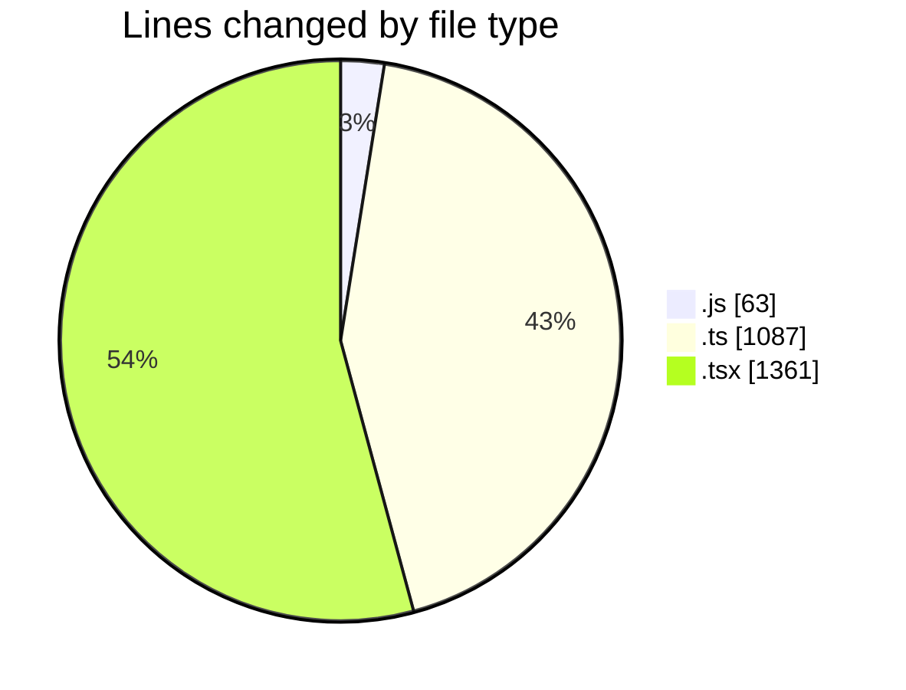
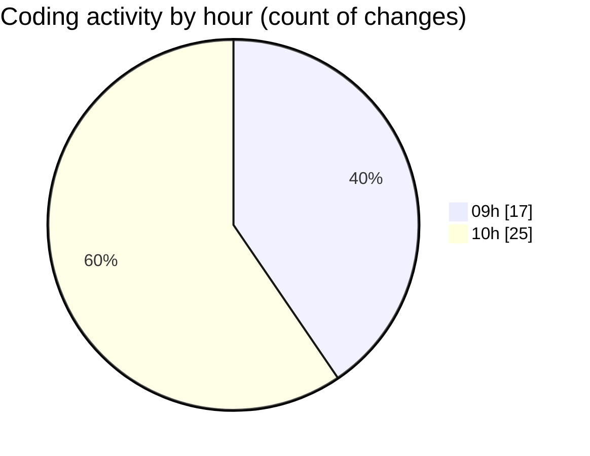

# cda - Activity Summary 

## Overall Statistics

| Stat                   | Value                                                             |
| ---------------------- | ----------------------------------------------------------------- |
| **Lines Added** (➕)   | 2012                                          |
| **Lines Removed** (➖) | 499                                        |
| **Net Change** (↕)    | 1513                |
| **Active Time** (⌚)   | 26 minutes |

## Modified Files
- **skills.js** (+8, -14)
- **queries.js** (+14, -27)
- **skill-queries.ts** (+22, -201)
- **GroupDetails.tsx** (+0, -24)
- **skill-people-queries.ts** (+0, -3)
- **skill-group-queries.ts** (+95, -98)
- **GroupMembersList.tsx** (+74, -74)
- **App.tsx** (+80, -10)
- **declarations.d.ts** (+445, -0)
- **DateSwitcher.test.tsx** (+268, -11)
- **getWeekInMonth.test.ts** (+108, -21)
- **dateOnly.ts** (+22, -0)
- **DateSwitcher.tsx** (+105, -0)
- **Sidebar.tsx** (+86, -0)
- **Home.tsx** (+459, -16)
- **getWeeksInMonth.ts** (+72, -0)
- **MonthlyViewRow.test.tsx** (+154, -0)

## Visualizations

### By File Type (Lines Changed)

### By Hour (Estimated Activity Count)

> **Last Updated:** 04/08/2026, 10:27:11