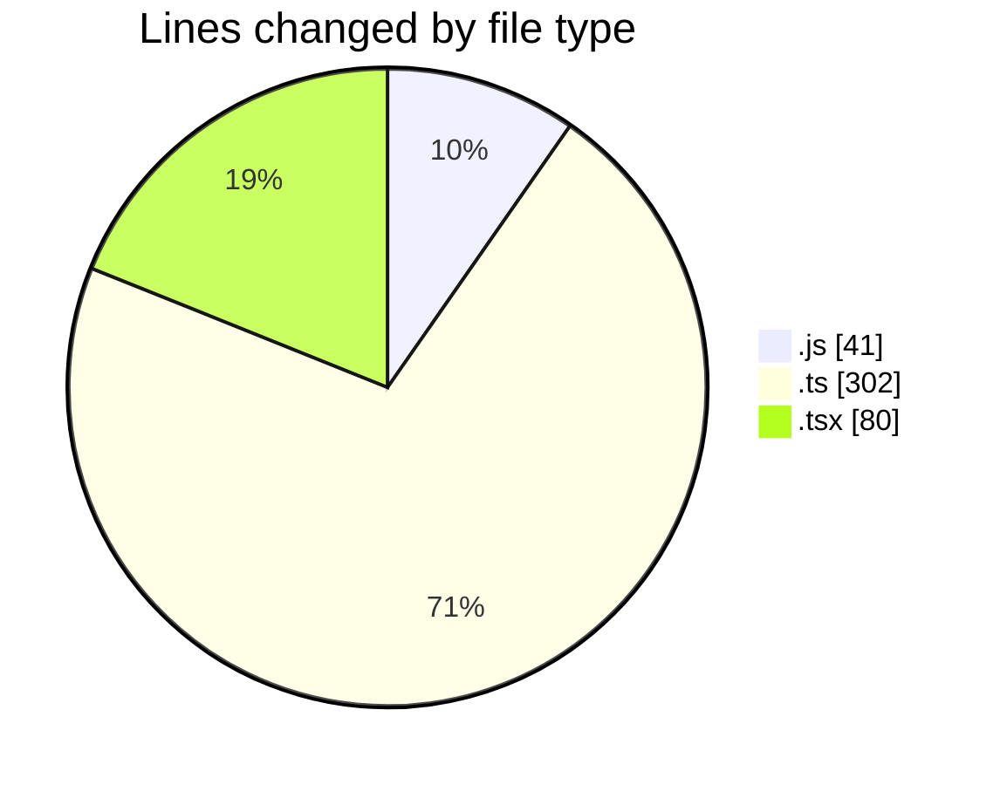
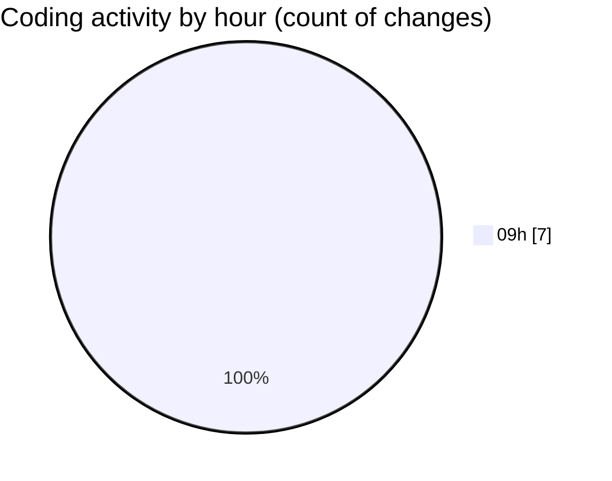

# cda - Activity Summary 

## Overall Statistics

| Stat                   | Value                                                             |
| ---------------------- | ----------------------------------------------------------------- |
| **Lines Added** (➕)   | 0                                          |
| **Lines Removed** (➖) | 423                                        |
| **Net Change** (↕)    | -423                |
| **Active Time** (⌚)   | 0 minute |

## Modified Files
- **skills.js** (+0, -14)
- **queries.js** (+0, -27)
- **skill-queries.ts** (+0, -201)
- **GroupDetails.tsx** (+0, -6)
- **skill-people-queries.ts** (+0, -3)
- **skill-group-queries.ts** (+0, -98)
- **GroupMembersList.tsx** (+0, -74)

## Visualizations

### By File Type (Lines Changed)

### By Hour (Estimated Activity Count)

> **Last Updated:** 04/08/2026, 09:07:11