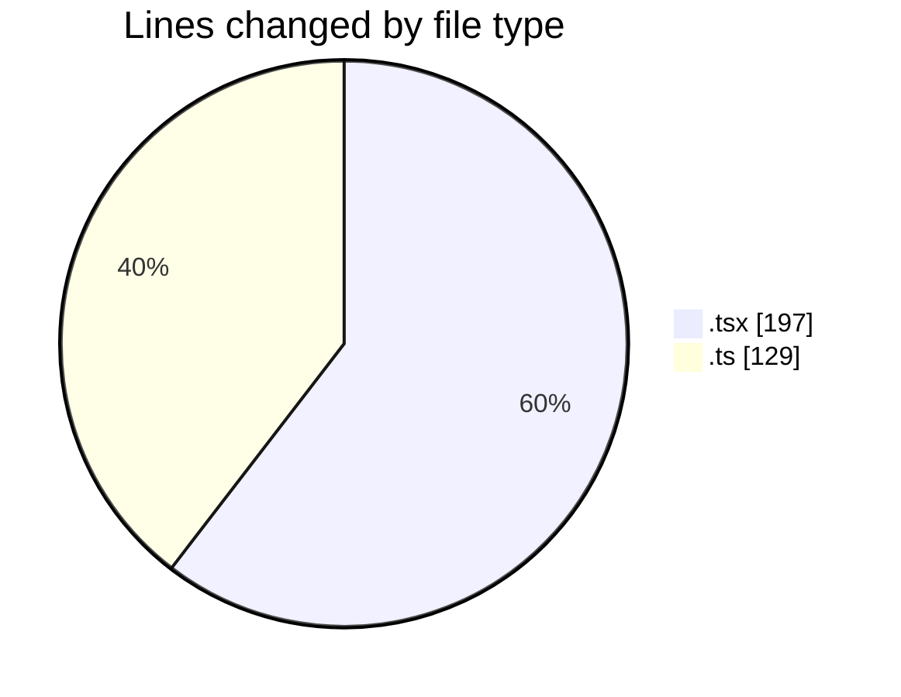
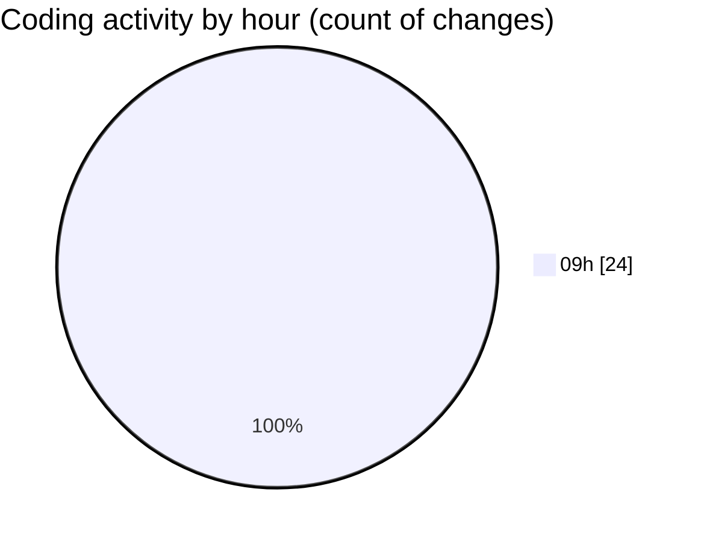

# cda - Activity Summary 

## Overall Statistics

| Stat                   | Value                                                             |
| ---------------------- | ----------------------------------------------------------------- |
| **Lines Added** (➕)   | 238                                          |
| **Lines Removed** (➖) | 88                                        |
| **Net Change** (↕)    | 150                |
| **Active Time** (⌚)   | 21 minutes |

## Modified Files
- **GroupDetails.tsx** (+46, -24)
- **mutations.ts** (+96, -0)
- **MonthlyViewRow.test.tsx** (+1, -0)
- **WeekView.tsx** (+0, -1)
- **Sidebar.tsx** (+1, -0)
- **getWeeksInMonth.ts** (+1, -0)
- **DateSwitcher.tsx** (+7, -0)
- **Home.tsx** (+0, -16)
- **getWeekInMonth.test.ts** (+14, -0)
- **DateSwitcher.test.tsx** (+31, -0)
- **WeekViewHeader.tsx** (+0, -3)
- **App.tsx** (+0, -39)
- **DayView.tsx** (+1, -0)
- **useDateViewSwipe.ts** (+17, -0)
- **AllocateDay.tsx** (+1, -0)
- **DutyWeekWrapper.tsx** (+0, -3)
- **DateView.tsx** (+1, -0)
- **getBorderStyle.ts** (+1, -0)
- **WeekTab.tsx** (+1, -0)
- **MonthlyViewRow.tsx** (+0, -2)
- **App.tsx** (+19, -0)

## Visualizations

### By File Type (Lines Changed)

### By Hour (Estimated Activity Count)

> **Last Updated:** 05/08/2026, 09:17:12